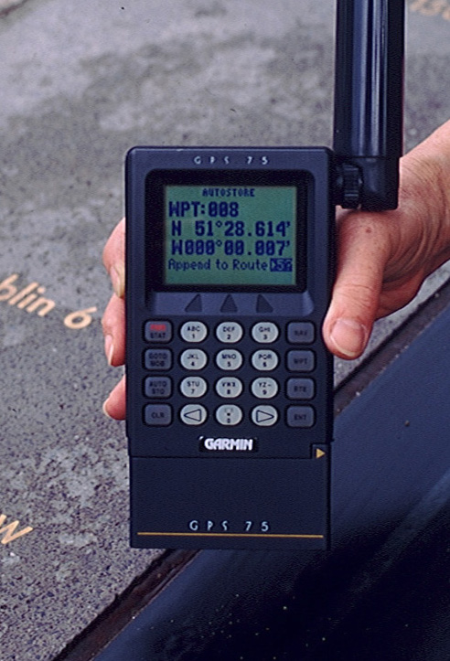

<!-- .slide: data-background-image="../shared_images/World3D_600.png"  data-background-position="right 10px bottom 20px"  data-background-size="40%" -->
# GIS concepts

### David Orme

---

# What is a GIS?

<!-- .element height="250px"  --> 
<!-- .element height="250px" --> 
<!-- .element height="250px" --> 
<!-- .element height="200px"--> 
<!-- .element height="200px" --> 

----

# What is a GIS?

Many things to many people but at core is any system used for:

  - creating,
  - storing,
  - manipulating,
  - analysing and
  - presenting geographic information

----

# What is <ins>geographic information</ins>?

Any piece of data that can be located in space, using:
 
 

 
  - A set of coordinates
  - A known coordinate system

 

Without **both** of these bits of information, we do not have geographic information!

---

# Spherical coordinates

**Latitude** 

  - an angle above or below the equator
  - points of equal latitude form a parallel
  - distance between parallels is constant*

Notes:
Not quite constant because of flattening. 1 degree of latitude is:

* 110574m at Equator
* 111694m at Poles

----

# Spherical coordinates

**Longitude**:

  - an angle around the equator
  - points of equal longitude form a meridian
  - distance between meridians varies

----

# Spherical coordinates

**Latitude and longitude**:

  - 90°0’0” E, 30°0’0” N
  - 90.00 E, 30.00 N
  - Can include height:
  - Near Lhasa, Tibet   (c. 5,500 m)

Notes:
* What is 5,500m a measurement from? 
* What do we need to make our coordinate system.

---

# Geographic coordinate system

* The Earth is not a sphere (~ 1 in 298 flattening)
* There are **many** reference ellipsoids or datums.

| Name 	| requator (m) 	| rpoles (m) 	|
|---	|---:	|---:	|
| Airy 1830	| 6,377,563.4	| 6,356,256.91	|
| Clarke 1866	| 6,378,206.4	| 6,356,583.8	|
| International 1924	| 6,378,388	| 6,356,911.9	|
| WGS 1984	| 6,378,137	| 6,356,752.31	|

----

# Geographic coordinate system

  - Unfortunately, the Earth isn’t a ellipsoid either.
  - Distribution of mass is uneven and dynamic

----

# Geographic coordinate system

**Geoid**

  - Surface of equal gravitational force
  - Up and down are **perpendicular** to the local geoid
  - A level surface is **tangent** to the local geoid

 

 <!-- .element width="100%"  --> 

Notes:
* Down does not necessarily go through the centre of the earth

----

# Geographic coordinate system

Notes:
GPS uses height above ellipsoid
- can lead to problems relative to sea level.
- receivers contain a low resolution look up table for the separation.

----

# WGS 84

  - Combined datum and geoid giving a standard global coordinate system
  - Uses modern satellite data to provide ellipsoid measurements and gravity model
  - Used by GPS
  - Prime meridian: 0°0’5.31”E !

Notes:
* International Reference Meridian
* Currently 100m East of Greenwich Meridian and moving!
* Local vs geocentric vertical

---

# Local geographic datum

  - The fit between a geoid and a datum varies in space
  - Global models, like WGS 84, work well on average
  - Countries adopt local datum models that fit better locally

----

# Local geographic datum

  - British National Grid uses the **OSGB 36 datum**
  - Same latitude & longitude + different datum = datum shift
  - In Cornwall, a WGS 84 point is ~70 m east and ~ 70 m south of OSGB 36.
  - The shift varies nationally

----

# Datum shift

<!-- .element width="75%"  --> 

---

# Spherical geometry

  - Great circles
  - Spherical ‘triangle’
  - **Spherical** geometry:
     - exact and fast
  - **Ellipsoidal** geometry:
     - iterative and slow

<!-- .element width="100%"  --> 

Notes:
Great circle
- where a plane through the centre hits the surface
 - shortest distance by haversine formula
Triangle
- angles sum to more than 180

----

# Spherical geometry

  - Globes not convenient or easily scalable
  - Precise calculations slow
  - Not easily useable on flat
screen or on paper
  - Need a flat representation of space

<!-- .element width="100%"  --> 

---

# Projected coordinate systems

> It is impossible to project an spherical surface onto a plane without distortion (Gauss, 1827).

<!-- .element width="90%"  --> 

Notes:
  - The ellipsoid surface of the Earth for small distances (~ 10 km) is flat enough for simple purposes but for anything else...

----

# Projected coordinate systems

Map projections can preserve:

  - **Shape**: conformal maps
  - **Area**: equal-area maps
  - **Distance**: equi-distant maps   
  - **Direction**: azimuthal maps

But most projected coordinate systems can only preserve **one** of these things.

----

# Projected coordinate systems

**Tissot indicatrix**:

  - An circle on the surface of the Earth.
  - All points on the edge are equidistant from the center.
  - Show distortion of ellipsoid surface on planar projections

<!-- .element width="100%"  --> 

----

# Projected coordinate systems

**Equirectangular**:  latitude and longitude as X and Y

Notes:
Doesn’t preserve anything much,
- distance/scale along vertical lines (great circles)

----

# Projected coordinate systems

Classification according to mapping to planar surface:

----

# Projected coordinate systems

**Gnomonic**: planar, preserves bearings from a single central point, but little else.

<!-- .element width="65%"  --> 

Notes:
Great circles in all directions from centre of map

----

# Projected coordinate systems

**Cylindrical**: preserves area, not shape

Notes:
Imagine running an old fluorescent tube down the middle and turning it on.
Behrmann projection
* Notice compression of higher latitudes

----

# Projected coordinate systems
 
 **Mercator**: preserves shape, not scale

Notes:
Inflate spherical balloon inside a cylinder coated with glue

----

# Projected coordinate systems

**Fuller Dymaxion**: compromise projection

Notes:
Local projections onto triangular planes Borders go through sea
No up or down

---

# Geographic data

  - A **Coordinate system** and:
    - **Vector** data: coordinates of points, lines, polygons
    - **Raster** data
        - grid data
        - satellite and aerial images

----

# Raster data

An **image** covering a continuous surface

  - Made up of individual **pixels**, each with a **value**
    - Categorical: land cover, species presence
    - Continuous: temperature, precipitation
  - Has a **resolution** (pixel size)
  - Needs **origin** and coordinate system

----

# Raster data

<!-- .element width="70%"  -->

----

# Vector Data

A set of *features*, containing one of:

  - Individual **points**, or sets of connected points forming **lines** or **polygons**
  - Needs a coordinate system
  - Coordinates are  a precise location, but may have precision or accuracy information
  - Features may have an attribute table.

----

# Vector Data

<!-- .element width="70%"  -->

----

# Data comparison

**Raster**

* Fixed grid
* One value per pixel per bands
* Often multiple stacked bands
* Attribute tables for _values_ (VAT)

**Vector**

* Features with arbitrary shapes
* Attribute tables for _features_

