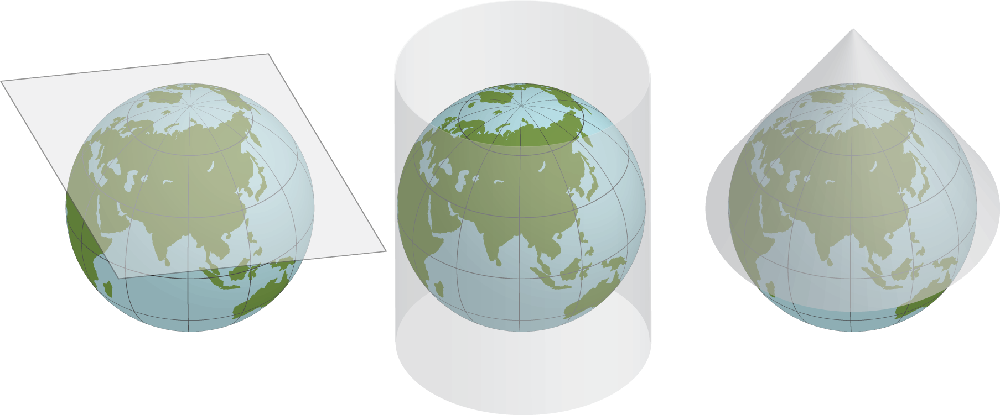

<!-- markdownlint-disable MD024 MD025 MD033 MD035 MD036-->

# GIS concepts

## David Orme

---

# What is a GIS?

----

# What is a GIS?

Many things to many people but at core is any system used for:

- creating,
- storing,
- manipulating,
- analysing and
- presenting geographic information

----

# What is geographic information?

Any piece of data that can be located in space, using:

- A set of coordinates
- A known coordinate system

Without **both** of these bits of information, we do not have geographic information!

---

# Spherical coordinates

**Latitude**

- an angle **above or below** the equator
- points of equal latitude form a **parallel**
- distance between parallels is constant*

<!--
Not quite constant because of flattening. 1 degree of latitude is:

- 110574m at Equator
- 111694m at Poles
-->

----

# Spherical coordinates

**Longitude**:

- an angle **around** the equator
- points of equal longitude form a **meridian**
- distance between meridians **varies**

----

# Spherical coordinates

**Latitude and longitude**:

- 90° 0’ 0” E and 30° 0’ 0” N
- 90.00 E, 30.00 N

**3D coordinates**

- Can include height
- In Tibet: 5,500 m
- Height above **what?**

<!--
- What is 5,500m a measurement from?
- What do we need to make our coordinate system.
-->

---

# Geographic coordinate system

- The Earth is not a sphere (~ 1 in 298 flattening)
- There are **many** reference ellipsoids or datums.

| Name | requator (m)  | rpoles (m)  |
|--- |---: |---: |
| Airy 1830 | 6,377,563.4 | 6,356,256.91 |
| Clarke 1866 | 6,378,206.4 | 6,356,583.8 |
| International 1924 | 6,378,388 | 6,356,911.9 |
| WGS 1984 | 6,378,137 | 6,356,752.31 |

----

# Geographic coordinate system

- Unfortunately, the Earth isn’t a ellipsoid either.
- Distribution of mass is uneven and dynamic

----

# Geographic coordinate system

**Geoid**

- Surface of equal gravitational force
- Up and down are **perpendicular** to the local geoid
- A level surface is **tangent** to the local geoid

<!--
- Down does not necessarily go through the centre of the earth
-->

----

# Geographic coordinate system

<!--
GPS uses height above ellipsoid
- can lead to problems relative to sea level.
- receivers contain a low resolution look up table for the separation.
-->

----

# WGS 84

- Combined datum and geoid giving a standard global coordinate system
- Uses modern satellite data to provide ellipsoid measurements and gravity model
- Used by GPS
- Prime meridian: 0°0’5.31”E !

<!--
- International Reference Meridian
- Currently 100m East of Greenwich Meridian and moving!
- Local vs geocentric vertical
-->

---

# Local geographic datum

- The fit between a geoid and a datum varies in space
- Global models, like WGS 84, work well on average
- Countries adopt local datum models that fit better locally

----

# Local geographic datum

- WGS84
  - -0.639875°W
  - 51.4090°N
- UK uses the **OSGB 36 datum**
  - -0.638331°W
  - 51.4085°N
- The shift varies nationally

----

# Datum shift

---

# Spherical geometry

- Great circles
- Spherical ‘triangle’
- **Spherical** geometry:
  - exact and fast
- **Ellipsoidal** geometry:
  - iterative and slow

<!--
Great circle
- where a plane through the centre hits the surface
- shortest distance by haversine formula
Triangle
- angles sum to more than 180
-->

----

# Spherical geometry

- Globes not convenient or easily scalable
- Precise calculations slow
- Not easily useable on flat screen or on paper
- Need a flat representation of space

---

# Projected coordinate systems

> It is impossible to project an spherical surface onto a plane without distortion
> (Gauss, 1827).

<!--
- The ellipsoid surface of the Earth for small distances (~ 10 km) is flat enough for
  simple purposes but for anything else...
-->

----

# Projected coordinate systems

Map projections can preserve:

- **Shape**: conformal maps
- **Area**: equal-area maps
- **Distance**: equi-distant maps
- **Direction**: azimuthal maps

But most projected coordinate systems can only preserve **one** of these things.

----

# Projected coordinate systems

**Tissot indicatrix**:

- An circle on the surface of the Earth.
- All points on the edge are equidistant from the center.
- Show distortion of ellipsoid surface on planar projections

----

# Projected coordinate systems

**Equirectangular**:  latitude and longitude as X and Y

<!--
Doesn’t preserve anything much,
- distance/scale along vertical lines (great circles)
-->

----

# Projected coordinate systems

Classification according to mapping to planar surface:

----

# Projected coordinate systems

**Gnomonic**: planar, preserves bearings from a single central point, but little else.

<!--
Great circles in all directions from centre of map
-->

----

# Projected coordinate systems

**Cylindrical**: preserves area, not shape

<!--
Imagine running an old fluorescent tube down the middle and turning it on.
Behrmann projection
- Notice compression of higher latitudes
-->

----

# Projected coordinate systems

**Mercator**: preserves shape, not scale

<!--
Inflate spherical balloon inside a cylinder coated with glue
-->

----

# Projected coordinate systems

**Fuller Dymaxion**: compromise projection

<!--
- Local projections onto triangular planes Borders go through sea
- No up or down
-->

---

# Geographic data

- A **Coordinate system** and:
  - **Vector** data
    - coordinates of points, lines, polygons
  - **Raster** data
    - grid data
    - satellite and aerial images

----

# Raster data

An **image** covering a continuous surface

- Individual **pixels**, each with a **value**
  - Categorical: land cover, species presence
  - Continuous: temperature, precipitation
- Has a **resolution** (pixel size)
- Needs **origin** and coordinate system

----

# Raster data

----

# Vector Data

A set of *features*, containing one of:

- Individual **points**, or sets of connected points forming **lines** or **polygons**
- Needs a coordinate system
- Coordinates are  a precise location, but may have precision or accuracy information
- Features may have an attribute table.

----

# Vector Data

----

# Data comparison

**Raster**

- Fixed grid
- One value per pixel per bands
- Often multiple stacked bands
- Attribute tables for *values* (VAT)

**Vector**

- Features with arbitrary shapes
- Attribute tables for *features*

