<!-- markdownlint-disable MD024 MD025 MD033 MD035 MD036-->

# Remote Sensing

## David Orme

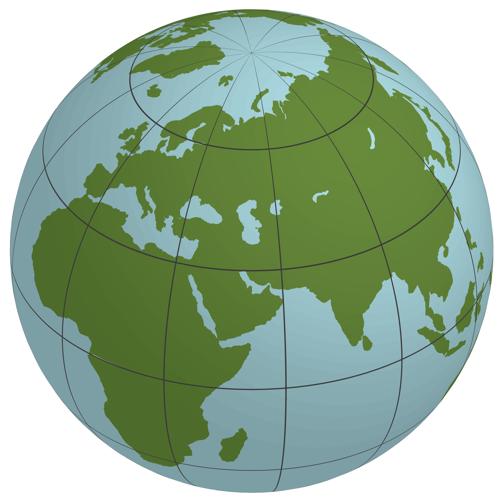

---

# Overview

- Remote sensing concepts
- Resolution
  - Spectral
  - Spatial
  - Temporal
- Earth observation products

---

# Mapping landscapes manually

**Pros**

- Very fine level of detail

**Cons**

- Expensive
- Slow
- Inconsistency between locations and sampling periods

---

# Maps from images

Aerial photography  
(1900s)
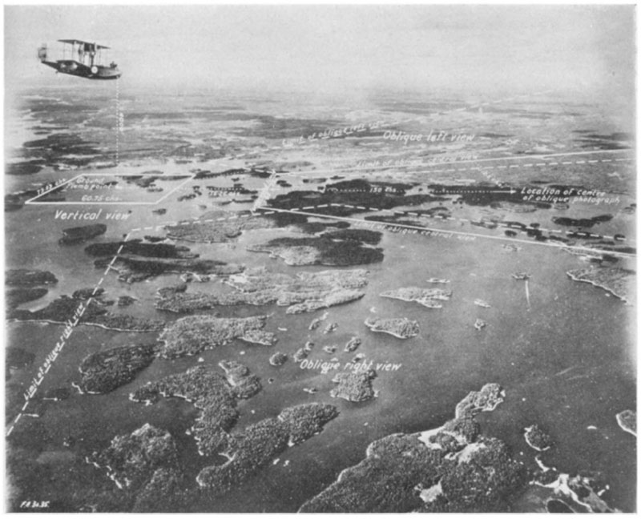

Satellite imagery  
(1950s)
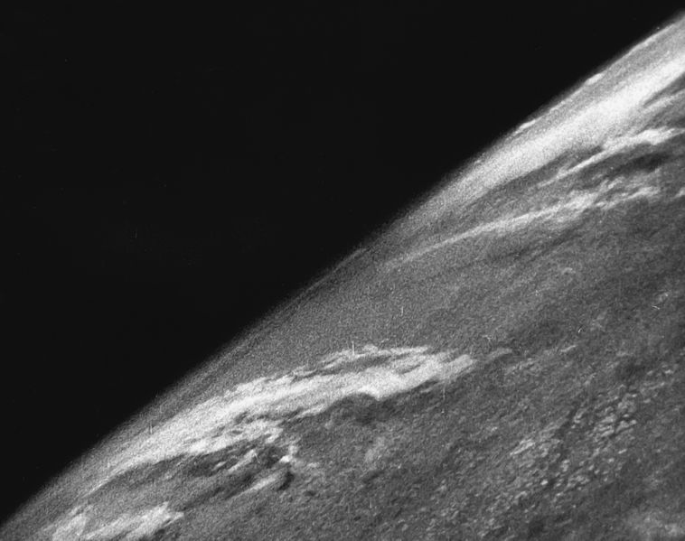

<!--
Elifrits et al. 1978 Mapping land cover from satellite images: A basic, low cost
approach. EARTH RESOURCES AND REMOTE SENSING. Image taken from a V2 rocket in 1946
-->

---

# Remote sensing

Remote sensors can be:

**Passive**: sense reflected solar radiation

**Active**:  emit radiation and sense reflection

- LIDAR (light)
- RADAR (microwaves)
- Alteration in reflected light
- Trip time gives heights

---

# Reflectance

**Albedo**: the proportion of radiation reflected from a surface, **strongly** affected by texture and angle of incidence.

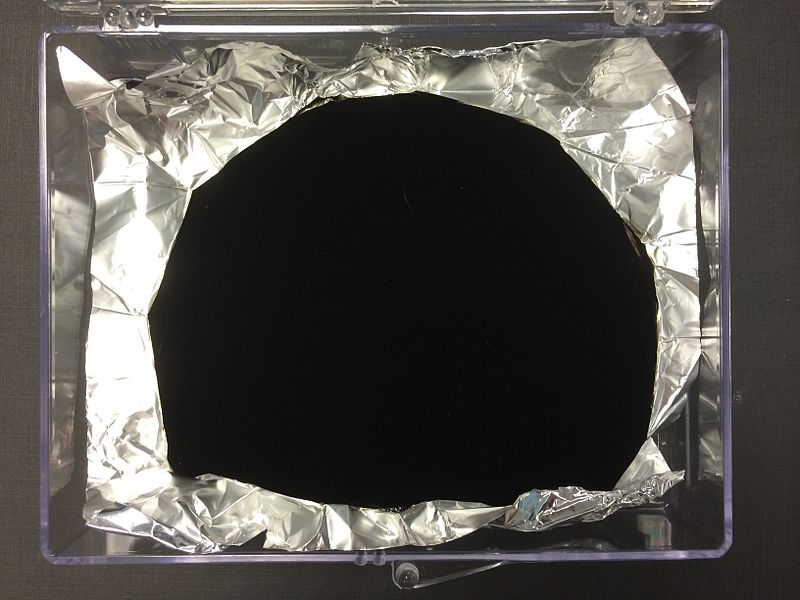

----

# Electromagnetic spectrum

----

# Reflectance

**Monochrome images**

- Different objects have different albedo
- Construct maps by looking at contrast, texture and edges

<!--
Sveti Stefan, Montenegro: five star island hotel resort
-->

----

# Reflectance

**Multispectral images**  

- Albedo of surfaces vary with wavelength
- Compare **bands** recording reflectance in different wavelengths

----

# Reflectance

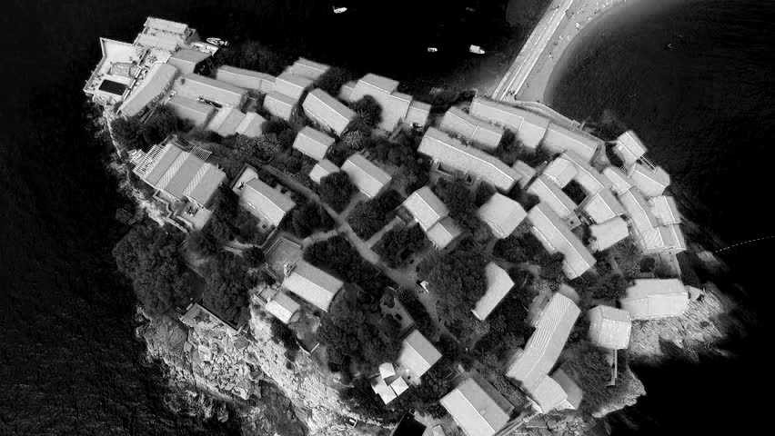

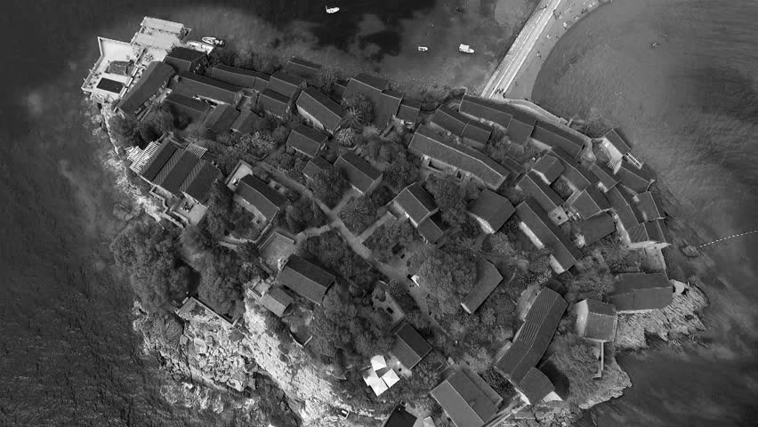

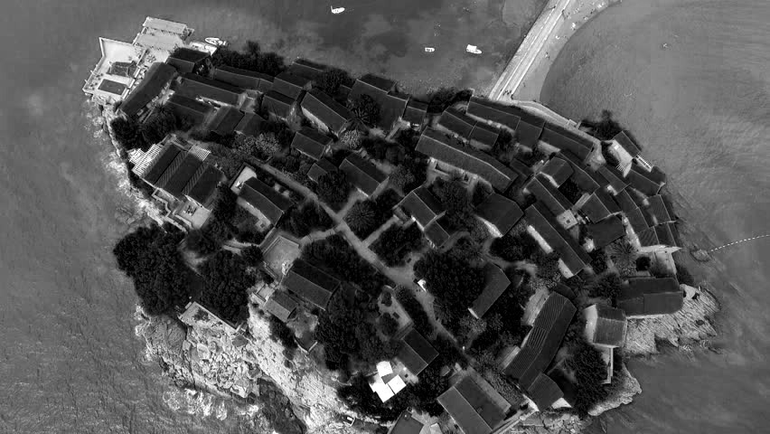

---

# Satellite orbits

- **High earth** geostationary orbits (weather satellites),
- **Mid earth orbits** (navigation and communications)
- **Low earth orbits** (earth observation)
- **Sun synchronous** orbit (same time of day)

<!--
HEO: stationary, MEO: 2-24 hour orbits, LEO: 90 - 120 minutes
-->

----

# Spatiotemporal resolution

**Low earth orbits**:

- Close to the planet
- High spatial resolution
- Narrow path widths
- Small scenes
- Less frequent images
- Use **constellations** of satellites

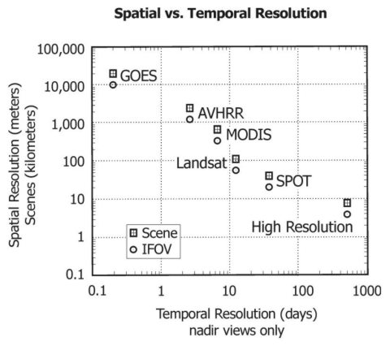

----

# Spatiotemporal resolution

**High earth orbits**:

- Far out in space
- Low spatial resolution
- No path width
- Global scenes
- Can take images constantly

----

# Spatiotemporal resolution

**Meteosat**
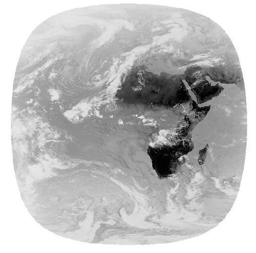

**Pleiades**

----

# Spectral resolution

- Determined by the satellite mission
- Atmospheric absorption of radiation
- Light-gathering sets resolution and band width

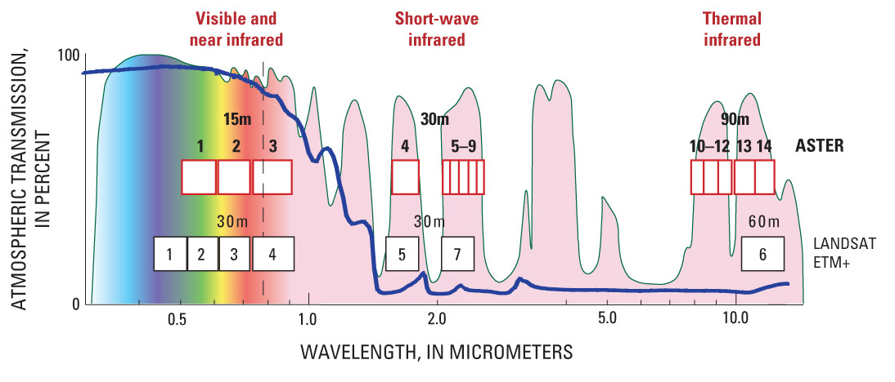

<!--
Pink areas on image show atmospheric absorption / transmission
-->

----

# Example platforms

| Satellite  | N  | Bands | Revisit | Resolution (m) |
|---|---:|---:|---:|---|
| Pleiades  | 2  | 5 | 1 | 2 / 0.5 |
| Rapid  Eye | 5  | 5 | 1 | 5 |
| Spot  7 | 1  | 5 | 2-3 | 6 / 1.5 |
| ASTER  | 1  | 14 | 16  | 90 / 30 / 15 |
| Landsat  8 | 1  | 11 | 16  | 100 / 30 / 15 |
| MODIS Terra | 1  | 36 | 1 - 2 | 1000 / 500 / 250 |

---

# Using satellite images

----

# Using satellite images

Multiple steps may be needed to use data:

- **Georeferencing**: where is the image?
- **Orthorectification**: remove perspective and terrain effects
- **Calibration**: convert the sensor value (an integer ) to an actual reflectance value
- **Atmospheric correction**: aerosols and water vapour can all impose spectral biases
  on reflected light and vary on a daily basis.

----

# Using satellite images

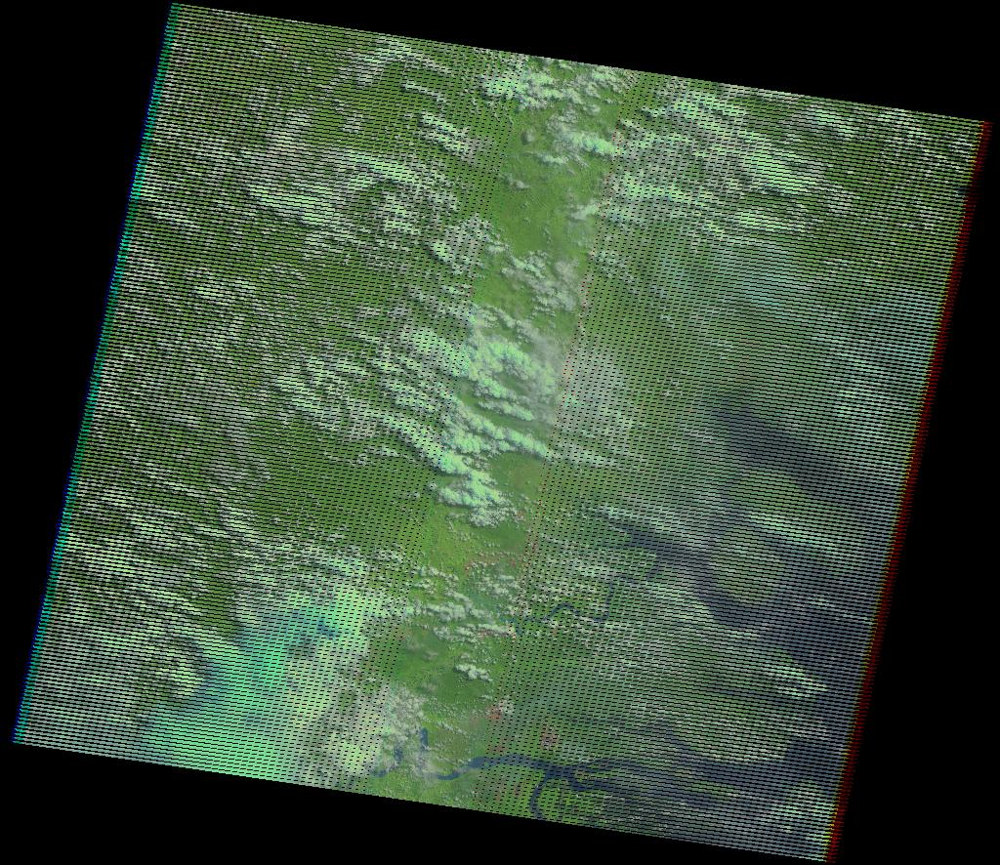

<!--
Failure of the scan line corrector in 2003
-->

---

# Earth observation products

Use satellite reflectance data to produce derived maps

- Use standardised algorithms
- Map land surface traits at global scale
- Temporal scales: daily to annual
- Resolution: 250 m to > 8 km spatial resolution
- Validation: many have pixel by pixel 'accuracy'

Four examples of increasing complexity

---

# Vegetation indices

Simple direct calculation from sensor values:

- Normalized Difference Vegetation Index:

$${\mbox{NDVI}}={\frac  {({\mbox{NIR}}-{\mbox{RED}})}{({\mbox{NIR}}+{\mbox{RED}})}}$$

- Enhanced Vegetation Index:

$${\displaystyle EVI=G\cdot {\frac {(\mbox{NIR}-\mbox{RED})}
   {(\mbox{NIR}+C_1\cdot \mbox{RED}-C_2\cdot \mbox{Blue}+L)}}}$$

<!--- Soil and Atmospherically Resistant Vegetation Index:  
$${\displaystyle {\mbox{SAVI}}={\frac {({\mbox{1}}+{\mbox{L}})
   ({\mbox{NIR}}-{\mbox{Red}})}{({\mbox{NIR}}+{\mbox{Red}}+{\mbox{L}})}}}$$ -->

---

# Digital elevation models

- Shuttle Radar Topography Mission (SRTM)
- ASTER Terra DEM (stereoscopy)
- Both near global with 30 metre resolution

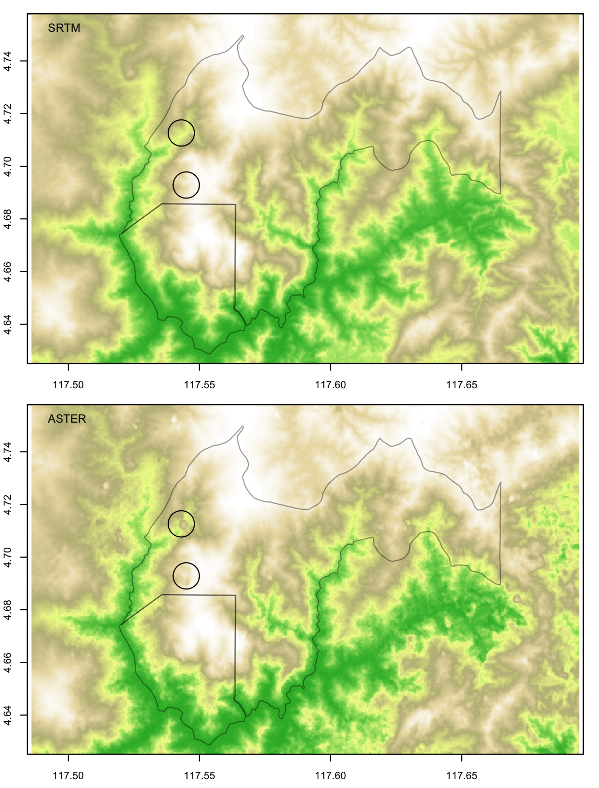

---

# Fire signatures

Live fires:

- Spectral signature in **Infrared bands**
- [http://fires.globalforestwatch.org/map](http://fires.globalforestwatch.org/map)
- MODIS daily and 8 day fire observations at 1km resolution
- SPOT: annual fire frequencies (2000 - 2007)

Burned area:

- Change detection in successive images around fire pixels
- MODIS: monthly burned area in 500m pixels

---

# Land cover

Spectral signatures differ **between different surfaces**:

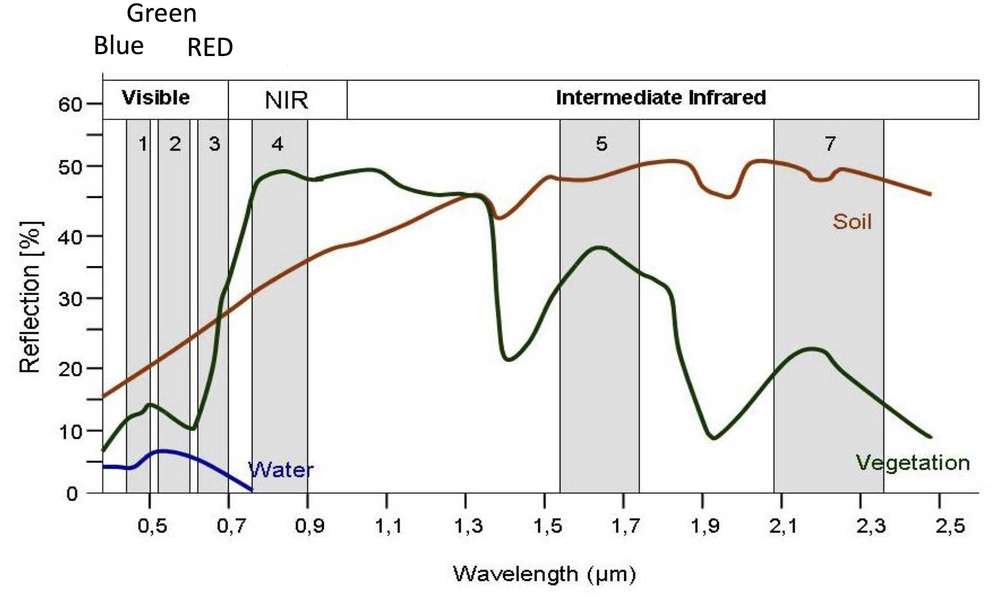

----

# Land cover

Spectral signatures differ **over time**:

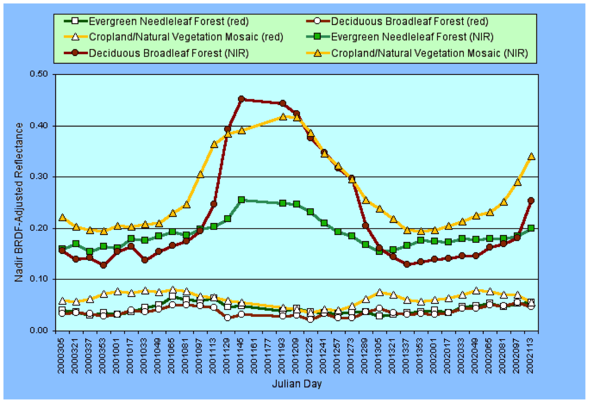

----

# Land cover

 **Ground sampling** ties spectral signatures to habitats

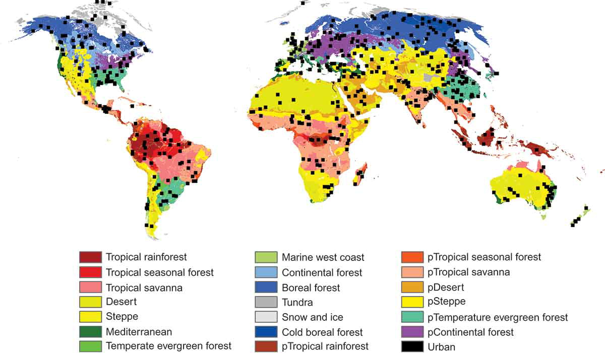

----

# Land cover

Profiles can then be used to **classify** pixels to habitats

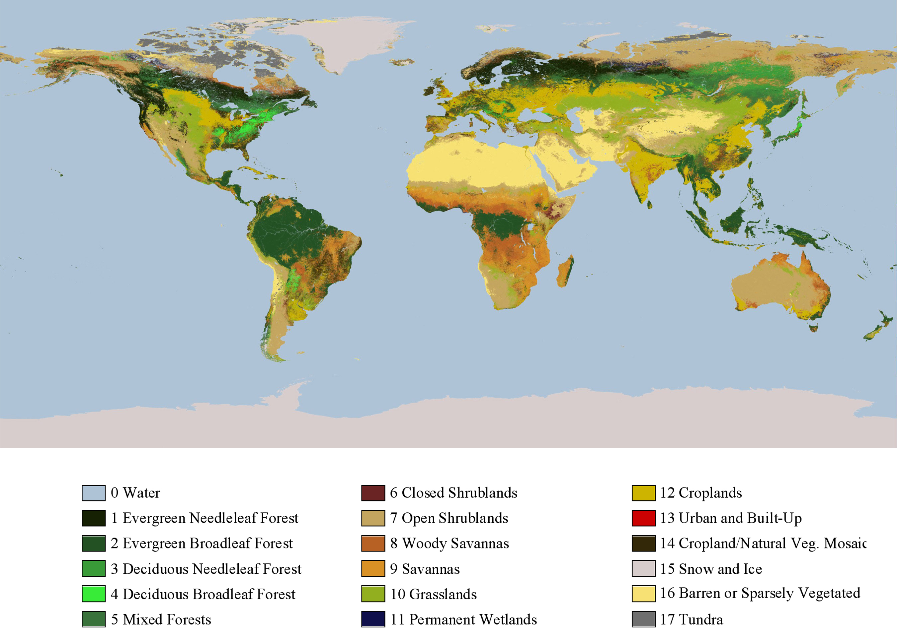

----

# Land cover

Examples:

- MODIS: Annual summaries at 500 metre resolution using five different classification
  schemes
- [http://landcover.org/data/](http://landcover.org/data/)
- [Global Forest
  Change](https://earthenginepartners.appspot.com/science-2013-global-forest)

---

# Productivity

Plants use light to store carbon.  If we know:

- The amount of **photosynthetically active light** absorbed
- The **radiation conversion efficiency**, given
  - the temperature and
  - humidity.
- Respiration costs.
  
Then we can predict gross and net primary productivity.

----

# Productivity

- Remotely sensed reflected light
- Ground measured incident light
- Biome models for **conversion efficiency** and **respiration**

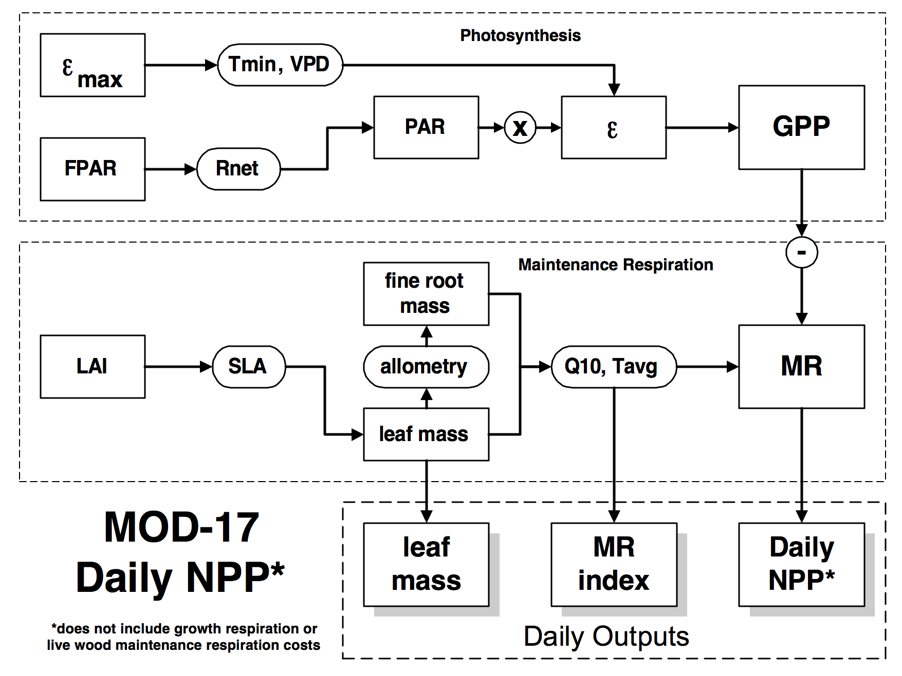

---

# Obtaining data

- [http://reverb.echo.nasa.gov/](http://reverb.echo.nasa.gov/)
- [http://earthexplorer.usgs.gov/](http://earthexplorer.usgs.gov/)
- [http://srtm.csi.cgiar.org/](http://srtm.csi.cgiar.org/)
- [https://earth.esa.int/web/guest/eoli](https://earth.esa.int/web/guest/eoli)
