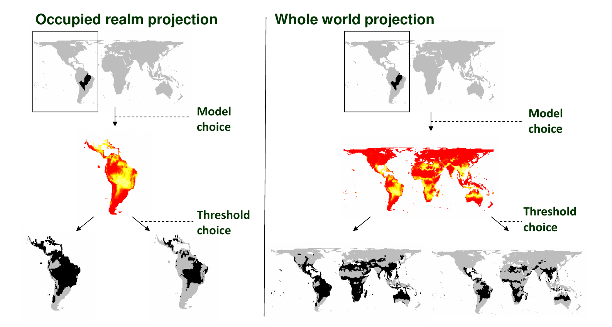

# Outline

* Introduction<!-- .element: style="color:red" -->  
* Process overview
* Theoretical framework
* Applications
* Assessing predictive performance
* Concerns and future directions 

---

# The unstoppable rise of SDMs

<!-- .element width="100%" --> 

<!-- .element width="100%" -->

<small>Lobo et al. 2010 Ecography 33:103-114.</small>

Notes:
Distribution modelling is now a major field of ecological research: between 2005 and 2010, there were over 850 publications in the Thomson Reuters web of knowledge database (found by a search for ‘species distribution mode*’ or ‘niche mode*’) compared with only 79 between 1999 and 2004.

---

# How do I know a SDM when I see it?

<!-- .element width="80%" --> 

<small>From  Elith et al. 2006 Ecography 29: 129-151,Table 4</small>

----

# How do I know a SDM when I see it?

* Species Distribution Modelling
* Climate Envelope Modelling
* Bioclimate Envelope Modelling
* Habitat Distribution Modelling
* Niche Modelling

---

# Outline

* Introduction
* Process overview<!-- .element: style="color:red" -->  
* Theoretical framework
* Applications
* Assessing predictive performance
* Concerns and future directions 

---

# What is species distribution modelling?

* Interpolating biological survey data in space
* Quantitative predictive models of species / environment relationships

<small> Elith et al. 2009 Ann Rev Ecol, Evol & Syst 40:677-697. </small>

---

# Overview of SDM process

* **Data** on species occurrence in geographical space
* **Maps** of environmental data
* A **model** to link occurrence data to the environmental variables
* A **GIS** with which to produce a map of predicted species occurrence
* A way to **validate** the predictions

---

# Why make spatial predictions of species distributions?

* To **understand** species distributions
* To **predict** the occurrence of a species for locations where good survey data are lacking
	* Guide for field surveys
	* Assess climate change impacts
	* Predict invasive species spread
	* Inform reserve selection

---

# Outline

* Introduction
* Process overview
* Theoretical framework<!-- .element: style="color:red" --> 
* Applications
* Assessing predictive performance
* Concerns and future directions 

---

# Niche theory

TODO - Venn1

<small>Soberón & Peterson (2005)</small>

---

# Niche theory

TODO - Venn2

<small>Soberón & Peterson (2005)</small>

---

# Niche theory

TODO - Venn2

<small>Soberón & Peterson (2005)</small>

---

# Niche theory

> “The n-dimensional hypervolume within which that species can survive and reproduce” 

Hutchinson (1957) 

TODO - Bivariate

---

# Environmental and geographical space

<!-- .element width="90%" -->

---

# Environmental and geographical space

<!-- .element width="80%" -->

--- 

# Modelled relationship

---

# Model algorithms

| Approach | Software | 
|---|---|
| Rectilinear envelope | BIOCLIM | 
| ENFA | BIOMAPPER | 
| Maximum Entropy | MAXENT | 
| Genetic algorithm | GARP | 
| Regression | e.g. R | 
| Machine-learning  | e.g. R | 
| Classification methods | Classification Tree Analysis | 

Notes:
ENFA: Ecological niche factor analysis

---

# Summary

	
Species Distribution Models:

* identify areas in a landscape,
* that have similar environments to localities,
* where the species has been observed.

**That's it!**

However, this information can be extremely useful in a wide range of applications.

---

# Outline

* Introduction
* Process overview
* Theoretical framework
* Applications<!-- .element: style="color:red" --> 
* Assessing predictive performance
* Concerns and future directions 

----

# Guiding field studies

<!-- .element width="60%" -->

Notes:
Used an SDM based on initial samples to identify stratified sampling zones for rare species

----

# Informing our view of the past

<!-- .element width="80%" -->

Notes:
Fitted SDMs for different climatic periods - less suitable area in interglacials

----

# Informing our view of the past

<!-- .element width="80%" -->

	
<!-- .element width="70%" -->

<!-- .element width="90%" -->

Notes:
Suggest that overlapping climatic niches and competition important

----

# Spread of invasive species

<!-- .element width="70%" -->

<!-- .element width="70%" -->
<!-- .element width="70%" -->

Notes:
Modelling spread using SDMs

----

# Impacts of climate change

	
<!-- .element width="80%" -->

<!-- .element width="50%" -->

Notes:
Controversial paper looking at range changes in response to climate change

----

# Comparing drivers

<!-- .element width="100%" -->

<small>Hof et al (2011) Nature  480: 516-519</small>

Notes:
Overlaps between pairs of drivers

----

# Future predictions

<!-- .element width="80%" -->

<small>Pearson et al. 2013 Nature Climate Change 3:673–677</small>

Notes:
Greening of the Arctic

---

# Outline

* Introduction
* Process overview
* Theoretical framework
* Applications
* Assessing predictive performance<!-- .element: style="color:red" --> 
* Concerns and future directions 

----

# Madagascan geckos

----

# Madagascan geckos

---

# Madagascan geckos

---

# Model evaluation

---

# Model errors

<!-- .element width="90%" -->

---

<!-- .slide: data-visibility="hidden" -->
# Confusion matrix

TODO - confusion matrix

---

# Probability to presence

---

# Outline

* Introduction
* Process overview
* Theoretical framework
* Applications
* Assessing predictive performance
* Concerns and future directions  <!-- .element: style="color:red" --> 

----

## Model choices matter

----

## Explain vs. Predict

* Occam’s razor: prefer a simple good explanation (model simplification)
* Prediction: prefer the best explanation even if elements are minor or unclear. Unavoidable with some methods.

----

## Model performance

Rapacciuolo et al 2012 PLoS One (7) 7 e40212

Notes:
Modelled past species distributions from climate using nine single techniques and a consensus approach, and projected the geographical extent of these models to a more recent time period based on climate change; we then compared model predictions with recent observed distributions in order to estimate the temporal transferability and prediction accuracy of our models.
Mn(PA) = prediction mean from all presence-absence modelling frameworks

---

## Model uncertainty

<!-- .element width="65%" -->

<small>_Diastella divaricata_</small>

<small>_Leucospermum hypophyllocarpodendrum_</small>

<small>from Pearson et al., Biogeography. 2006, Blackwell Publishing</small>

Notes:
TODO - y axis: Predicted percentage range gain / loss by 2030
Universal and no dispersal scenarios

---

## Ensemble forecasting

<!-- .element width="90%" -->

<small>Thuiller et al (2009) Ecography 32: 369 - 373</small>

---

## Danger, Will Robinson

**Assumptions**
* Appropriate data exist at a relevant scale
* Species are at equilibrium with their environment...

**Warnings**
* Garbage in, garbage out
* Model extrapolation in time or space  (transferability)
* The lure of complicated technology

---

## Lab data

<small>Araujo et al (2013) Ecology Letters 16: 1206 - 1209</small>

Notes:
Thermal tolerances of Liolaemus from a logistic SDM and from lab data.

---

# Future directions

* Incorporating **dispersal**
* Incorporating **biotic** interactions
* More **mechanistic** models 

---

## Connect to demography

<!-- .element width="80%" -->

---

## Community assembly

<!-- .element width="80%" -->

---

## Bayes and spatial autocorrelation

Blangiardo et al 2013  Spatial and spatio-temporal models with R-INLA. _Spatial and Spatio-temporal Epidemiology_ 4:33-49

---

# General reading

<small>

* Franklin, J. (2009) Mapping species distributions: spatial inference and prediction. Cambridge, Cambridge University Press.
* Guisan, A., and N. E. Zimmermann. (2000) Predictive habitat distribution models in ecology. Ecological Modelling,135:147-186.
* Elith J, Graham CH: (2009) Do they? How do they? WHY do they differ? On finding reasons for differing performances of species distribution models. Ecography, 32:66–77.
* Beale, C.M. and Lennon, J.K. (2012) Incorporating uncertainty in predictive distribution modelling. Phil Trans R. Soc. B 367:247-258

</small>

---

## Applied examples

<small>

* Singh, N.J, Yoccoz, N.G., Bhatnagar, Y.V., Fox, J.L. (2009) Using habitat suitability models to sample rare species in high-altitude ecosystems: A case study with Tibetan argali. Biodiversity and Conservation, 18: 2893-2908. 

* Nogués-Bravo D., Rodríguez J., Hortal J., Batra P., Araújo M. B. (2008) Climate change, humans, and the extinction of the woolly mammoth. PLoS Biol, 6, e79.

* Thomas, C. D., A. Cameron, R. E. Green, M. Bakkenes, L. J. Beaumont, Y. C. Collingham, B. F. N. Erasmus et al. (2004.) Extinction risk from climate change. Nature 427:145-148.

* Smolik, M. G., S. Dullinger, F. Essl, I. Kleinbauer, M. Leitner, J. Peterseil, L.-M. Stadler et al. (2009). Integrating species distribution models and interacting particle systems to predict the spread of an invasive alien plant. Journal of Biogeography 37:411-422.

* Raxworthy, C.J., Martinez-Meyer, E., Horning, N., Nussbaum, R.A., Schneider, G.E., Ortega-Huerta, A., and Peterson, A.T. (2003). Predicting distributions of known and unknown reptiles species in Madagascar. Nature. 426: 837-841. 

</small>

## Methods background

<small>

* Guisan, A., T. C. Edwards, and T. Hastie. 2002. Generalized linear and generalized additive models in studies of species distributions: setting the scene. Ecological Modelling 157:89-100 
* Thuiller, W., B. Laforcade, R. Engler, and M. B. Araújo. 2009. BIOMOD - a platform for ensemble forecasting of species distributions. Ecography 32:369 - 373.
* Elith, J., J. R. Leathwick, and T. Hastie. 2008. A working guide to boosted regression trees. Journal of Animal Ecology 77:802-813.
* Phillips, S. J., R. P. Anderson, and R. E. Schapire. 2006. Maximum entropy modeling of species geographic distributions. Ecological Modelling 190:231-259.

</small>
