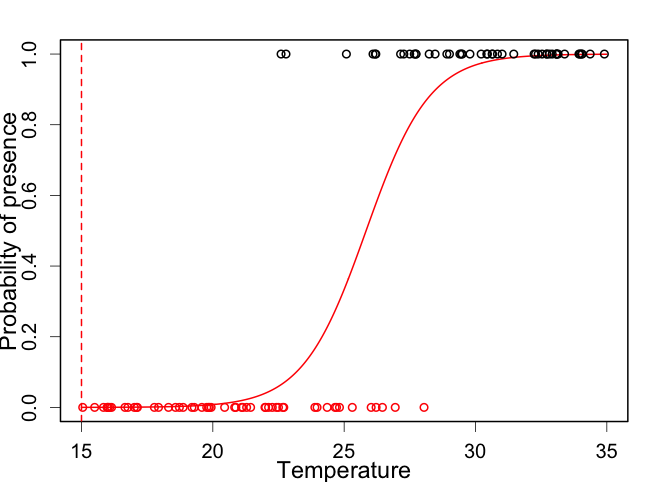
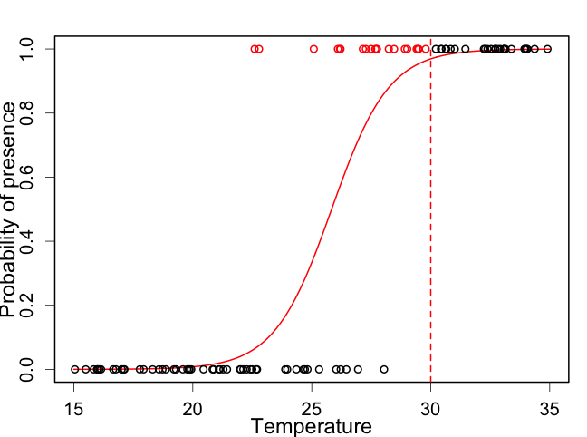
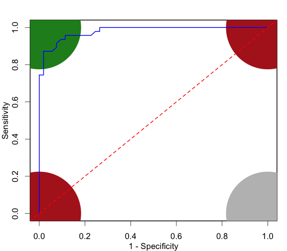
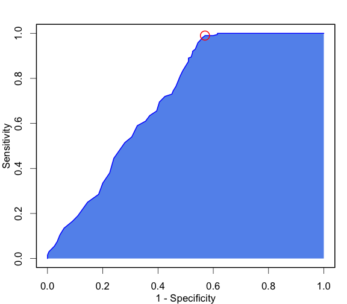

<!-- .slide: data-background-image="../shared_images/World3D_600.png"  data-background-position="right 10px bottom 20px"  data-background-size="40%" -->
# Assessing Model Accuracy

### David Orme

---

# Overview

  - The confusion matrix
  - Measures of model accuracy
  - Thresholds for continuous predictions
  - Application to Species Distribution Models

---

# MODIS land cover classification

Accuracy = 21906 / 29877 = 73.3%

----

# A simpler confusion matrix

Zoom in on just two of those categories:

Model predicts: Is this evergreen forest needleleaf or broadleaf

----

# Accuracy

Easy to calculate **accuracy**:

<table>
 <thead>
  <tr>
   <th style="text-align:left;">   </th>
   <th style="text-align:right;"> Pred. Needle </th>
   <th style="text-align:right;"> Pred. Broad </th>
   <th style="text-align:right;"> Sum </th>
  </tr>
 </thead>
<tbody>
  <tr>
   <td style="text-align:left;"> Obs. Needle </td>
   <td style="text-align:right;"> 1460 </td>
   <td style="text-align:right;"> 42 </td>
   <td style="text-align:right;"> 1502 </td>
  </tr>
  <tr>
   <td style="text-align:left;"> Obs. Broad </td>
   <td style="text-align:right;"> 31 </td>
   <td style="text-align:right;"> 4889 </td>
   <td style="text-align:right;"> 4920 </td>
  </tr>
  <tr>
   <td style="text-align:left;"> Sum </td>
   <td style="text-align:right;"> 1491 </td>
   <td style="text-align:right;"> 4931 </td>
   <td style="text-align:right;"> 6422 </td>
  </tr>
</tbody>
</table>

$$A = \frac{1460 + 4889}{1460 + 4889 + 42 +31} = 98.9\%$$

----

# Accuracy

But **random** models have ~50% accuracy!

<table>
 <thead>
  <tr>
   <th style="text-align:left;">   </th>
   <th style="text-align:right;"> Pred. Needle </th>
   <th style="text-align:right;"> Pred. Broad </th>
   <th style="text-align:right;"> Sum </th>
  </tr>
 </thead>
<tbody>
  <tr>
   <td style="text-align:left;"> Obs. Needle </td>
   <td style="text-align:right;"> 740 </td>
   <td style="text-align:right;"> 762 </td>
   <td style="text-align:right;"> 1502 </td>
  </tr>
  <tr>
   <td style="text-align:left;"> Obs. Broad </td>
   <td style="text-align:right;"> 2446 </td>
   <td style="text-align:right;"> 2474 </td>
   <td style="text-align:right;"> 4920 </td>
  </tr>
  <tr>
   <td style="text-align:left;"> Sum </td>
   <td style="text-align:right;"> 3186 </td>
   <td style="text-align:right;"> 3236 </td>
   <td style="text-align:right;"> 6422 </td>
  </tr>
</tbody>
</table>

$$A = \frac{740 + 2474}{6422} = 50.0\%$$

----

# Accuracy

Bad models: **everything is a broadleaf**

<table>
 <thead>
  <tr>
   <th style="text-align:left;">   </th>
   <th style="text-align:right;"> Pred. Needle </th>
   <th style="text-align:right;"> Pred. Broad </th>
   <th style="text-align:right;"> Sum </th>
  </tr>
 </thead>
<tbody>
  <tr>
   <td style="text-align:left;"> Obs. Needle </td>
   <td style="text-align:right;"> 0 </td>
   <td style="text-align:right;"> 1502 </td>
   <td style="text-align:right;"> 1502 </td>
  </tr>
  <tr>
   <td style="text-align:left;"> Obs. Broad </td>
   <td style="text-align:right;"> 0 </td>
   <td style="text-align:right;"> 4920 </td>
   <td style="text-align:right;"> 4920 </td>
  </tr>
  <tr>
   <td style="text-align:left;"> Sum </td>
   <td style="text-align:right;"> 0 </td>
   <td style="text-align:right;"> 6422 </td>
   <td style="text-align:right;"> 6422 </td>
  </tr>
</tbody>
</table>

$$A = \frac{0 + 4920}{6422} = 76.6\%$$

----

# Prevalence

Proportion of the observed positive outcomes

<table>
 <thead>
  <tr>
   <th style="text-align:left;">   </th>
   <th style="text-align:right;"> Pred. Pos </th>
   <th style="text-align:right;"> Pred. Neg </th>
   <th style="text-align:right;"> Sum </th>
  </tr>
 </thead>
<tbody>
  <tr>
   <td style="text-align:left;"> Obs. Pos </td>
   <td style="text-align:right;"> 1460 </td>
   <td style="text-align:right;"> 42 </td>
   <td style="text-align:right;"> 1502 </td>
  </tr>
  <tr>
   <td style="text-align:left;"> Obs. Neg </td>
   <td style="text-align:right;"> 31 </td>
   <td style="text-align:right;"> 4889 </td>
   <td style="text-align:right;"> 4920 </td>
  </tr>
  <tr>
   <td style="text-align:left;"> Sum </td>
   <td style="text-align:right;"> 1491 </td>
   <td style="text-align:right;"> 4931 </td>
   <td style="text-align:right;"> 6422 </td>
  </tr>
</tbody>
</table>

$$\mbox{Prevalence} = \frac{1502 }{6422} = 0.234$$

Notes:

Switching to POS NEG

----

# Accuracy

And **accuracy is affected by prevalence**

<table>
 <thead>
  <tr>
   <th style="text-align:left;">   </th>
   <th style="text-align:right;"> Pred. Pos </th>
   <th style="text-align:right;"> Pred. Neg </th>
   <th style="text-align:right;"> Sum </th>
  </tr>
 </thead>
<tbody>
  <tr>
   <td style="text-align:left;"> Obs. Pos </td>
   <td style="text-align:right;"> 0 </td>
   <td style="text-align:right;"> 35 </td>
   <td style="text-align:right;"> 35 </td>
  </tr>
  <tr>
   <td style="text-align:left;"> Obs. Neg </td>
   <td style="text-align:right;"> 0 </td>
   <td style="text-align:right;"> 6407 </td>
   <td style="text-align:right;"> 6407 </td>
  </tr>
  <tr>
   <td style="text-align:left;"> Sum </td>
   <td style="text-align:right;"> 0 </td>
   <td style="text-align:right;"> 6442 </td>
   <td style="text-align:right;"> 6442 </td>
  </tr>
</tbody>
</table>

$$A = \frac{0 + 6407}{6422} = 99.5\%$$

----

# Prediction outcomes

Giving some simple names to the four outcomes:

<table>
 <thead>
  <tr>
   <th style="text-align:left;">   </th>
   <th style="text-align:center;"> Pred. Pos </th>
   <th style="text-align:center;"> Pred. Neg </th>
  </tr>
 </thead>
<tbody>
  <tr>
   <td style="text-align:left;"> Obs. Pos </td>
   <td style="text-align:center;"> True Positive </td>
   <td style="text-align:center;"> False Negative </td>
  </tr>
  <tr>
   <td style="text-align:left;"> Obs. Neg </td>
   <td style="text-align:center;"> False Positive </td>
   <td style="text-align:center;"> True Negative </td>
  </tr>
</tbody>
</table>

----

# Prediction outcomes

Other more confusing names do get used:

<table>
 <thead>
  <tr>
   <th style="text-align:left;">   </th>
   <th style="text-align:center;"> Pred. Pos </th>
   <th style="text-align:center;"> Pred. Neg </th>
  </tr>
 </thead>
<tbody>
  <tr>
   <td style="text-align:left;"> Obs. Pos </td>
   <td style="text-align:center;"> True Positive </td>
   <td style="text-align:center;"> Type II Error </td>
  </tr>
  <tr>
   <td style="text-align:left;"> Obs. Neg </td>
   <td style="text-align:center;"> Type I Error </td>
   <td style="text-align:center;"> True Negative </td>
  </tr>
</tbody>
</table>

----

# Rates of outcomes

Divide the four outcomes by the **observed** positive and negative counts to give **rates**:

<table>
 <thead>
  <tr>
   <th style="text-align:left;">   </th>
   <th style="text-align:center;"> Pred. Pos </th>
   <th style="text-align:center;"> Pred. Neg </th>
  </tr>
 </thead>
<tbody>
  <tr>
   <td style="text-align:left;"> Obs. Pos </td>
   <td style="text-align:center;"> True Positive Rate </td>
   <td style="text-align:center;"> False Negative Rate </td>
  </tr>
  <tr>
   <td style="text-align:left;"> Obs. Neg </td>
   <td style="text-align:center;"> False Positive Rate </td>
   <td style="text-align:center;"> True Negative Rate </td>
  </tr>
</tbody>
</table>

----

# Rates of outcomes

Calculate those values:

|	| Pred. Pos	| Pred. Neg	|  Sum	|
|:-----------	| ------------:|	-----------:|	----:|
|Obs. Pos	| $$\frac{1460}{1502}=97.2\%$$	| $$\frac{42}{1502}=2.8\%$$ | 1502	|
|Obs. Neg  	| $$\frac{31}{4920}=0.6\%$$	| $$\frac{4889}{4920}=99.4\%$$	| 4920	|

----

# Sensitivity and Specificity

**Sensitivity**

  - Another name for the True Positive Rate
  - The proportion of correctly predicted positive observations

**Specificity**

  - Another name for the True Negative Rate
  - The proportion of correctly predicted negative observations

----

# Sensitivity and Specificity

<table>
 <thead>
  <tr>
   <th style="text-align:left;">   </th>
   <th style="text-align:right;"> Pred. Pos </th>
   <th style="text-align:right;"> Pred. Neg </th>
   <th style="text-align:right;"> Sum </th>
  </tr>
 </thead>
<tbody>
  <tr>
   <td style="text-align:left;"> Obs. Pos </td>
   <td style="text-align:right;"> 1460 </td>
   <td style="text-align:right;"> 42 </td>
   <td style="text-align:right;"> 1502 </td>
  </tr>
  <tr>
   <td style="text-align:left;"> Obs. Neg </td>
   <td style="text-align:right;"> 2010 </td>
   <td style="text-align:right;"> 2910 </td>
   <td style="text-align:right;"> 4920 </td>
  </tr>
  <tr>
   <td style="text-align:left;"> Sum </td>
   <td style="text-align:right;"> 3470 </td>
   <td style="text-align:right;"> 2952 </td>
   <td style="text-align:right;"> 6422 </td>
  </tr>
</tbody>
</table>

<table>
 <thead>
  <tr>
   <th style="text-align:left;">   </th>
   <th style="text-align:left;"> Pred. Pos </th>
   <th style="text-align:left;"> Pred. Neg </th>
  </tr>
 </thead>
<tbody>
  <tr>
   <td style="text-align:left;"> Obs. Pos </td>
   <td style="text-align:left;"> 97.2% </td>
   <td style="text-align:left;"> 2.8% </td>
  </tr>
  <tr>
   <td style="text-align:left;"> Obs. Neg </td>
   <td style="text-align:left;"> 40.9% </td>
   <td style="text-align:left;"> 59.1% </td>
  </tr>
</tbody>
</table>

---

# Cohen's kappa

Cohen's kappa ($\kappa$) is a measure of agreement that rescales accuracy ($A$) to account for chance agreement ($P_e$):

$$\kappa = \frac{A - P_e}{1- P_e}$$

It can take values from $-\infty$ to 1, where 1 is perfect prediction and anything below zero is worse than chance.

----

# Cohen's kappa

Multiply proportions of observed and predicted to get probability of each outcome

<table>
 <thead>
  <tr>
   <th style="text-align:left;">   </th>
   <th style="text-align:right;"> Pred. Pos </th>
   <th style="text-align:right;"> Pred. Neg </th>
   <th style="text-align:right;"> Sum </th>
  </tr>
 </thead>
<tbody>
  <tr>
   <td style="text-align:left;"> Obs. Pos </td>
   <td style="text-align:right;font-weight: bold;color: red !important;"> 1460 </td>
   <td style="text-align:right;"> 42 </td>
   <td style="text-align:right;"> 1502 </td>
  </tr>
  <tr>
   <td style="text-align:left;"> Obs. Neg </td>
   <td style="text-align:right;color: black !important;"> 31 </td>
   <td style="text-align:right;"> 4889 </td>
   <td style="text-align:right;"> 4920 </td>
  </tr>
  <tr>
   <td style="text-align:left;"> Sum </td>
   <td style="text-align:right;color: black !important;"> 1491 </td>
   <td style="text-align:right;"> 4931 </td>
   <td style="text-align:right;"> 6422 </td>
  </tr>
</tbody>
</table>

$$P_{YY} = \frac{1491}{6422} \times \frac{1502}{6422} = 0.054$$

Notes:
Example of calculation for one cell

----

# Cohen's kappa

<table>
 <thead>
  <tr>
   <th style="text-align:left;">   </th>
   <th style="text-align:right;"> Pred. Pos </th>
   <th style="text-align:right;"> Pred. Neg </th>
   <th style="text-align:right;"> p </th>
  </tr>
 </thead>
<tbody>
  <tr>
   <td style="text-align:left;"> Obs. Pos </td>
   <td style="text-align:right;"> 0.054 </td>
   <td style="text-align:right;"> 0.180 </td>
   <td style="text-align:right;"> 0.234 </td>
  </tr>
  <tr>
   <td style="text-align:left;"> Obs. Neg </td>
   <td style="text-align:right;"> 0.178 </td>
   <td style="text-align:right;"> 0.588 </td>
   <td style="text-align:right;"> 0.766 </td>
  </tr>
  <tr>
   <td style="text-align:left;"> p </td>
   <td style="text-align:right;"> 0.232 </td>
   <td style="text-align:right;"> 0.768 </td>
   <td style="text-align:right;"> 1.000 </td>
  </tr>
</tbody>
</table>

$$
P_e = P_{YY} +  P_{NN} = 0.054 + 0.588 = 0.642
$$
$$
\kappa = \frac{0.989 - 0.642}{1- 0.642} = 0.969
$$

----

# True Skill Statistic

<!-- .element width="80%" -->

----

# True Skill Statistic

An alternative measure is TSS:

$$
\mbox{TSS} = \mbox{Sensitivity} + \mbox{Specificity} - 1
$$
$$
\mbox{TSS} = [0, 1] + [0, 1] - 1
$$

 * TSS = 1 (perfect)
 * TSS = 0 (random)
 * TSS = -1 (always wrong)
 * Unaffected by prevalence.

<!-- Simulation of thresholding -->
  

----

# Wait, no. Not TSS!

Notes:
TSS not useful when low prevalence and  large numbers (SDMs!)

* Odds Ratio Skill Score (ORSS) 
* Symmetric Extremal Dependence Index (SEDI)

---

# Probabilistic classification

A model predicting the   probability of success / presence

----

# Threshold model

<table>
 <thead>
  <tr>
   <th style="text-align:left;">   </th>
   <th style="text-align:right;"> 0 </th>
   <th style="text-align:right;"> 1 </th>
  </tr>
 </thead>
<tbody>
  <tr>
   <td style="text-align:left;"> 1 </td>
   <td style="text-align:right;"> 0 </td>
   <td style="text-align:right;"> 50 </td>
  </tr>
  <tr>
   <td style="text-align:left;"> 0 </td>
   <td style="text-align:right;"> 0 </td>
   <td style="text-align:right;"> 50 </td>
  </tr>
</tbody>
</table>
<table>
 <thead>
  <tr>
   <th style="text-align:left;">   </th>
   <th style="text-align:right;"> value </th>
  </tr>
 </thead>
<tbody>
  <tr>
   <td style="text-align:left;"> Sens </td>
   <td style="text-align:right;"> 1 </td>
  </tr>
  <tr>
   <td style="text-align:left;"> Spec </td>
   <td style="text-align:right;"> 0 </td>
  </tr>
  <tr>
   <td style="text-align:left;"> TSS </td>
   <td style="text-align:right;"> 0 </td>
  </tr>
</tbody>
</table>

Notes:
Switched column orders to match graph.

----

# Threshold model

<table>
 <thead>
  <tr>
   <th style="text-align:left;">   </th>
   <th style="text-align:right;"> 0 </th>
   <th style="text-align:right;"> 1 </th>
  </tr>
 </thead>
<tbody>
  <tr>
   <td style="text-align:left;"> 1 </td>
   <td style="text-align:right;"> 3 </td>
   <td style="text-align:right;"> 47 </td>
  </tr>
  <tr>
   <td style="text-align:left;"> 0 </td>
   <td style="text-align:right;"> 22 </td>
   <td style="text-align:right;"> 28 </td>
  </tr>
</tbody>
</table>
<table>
 <thead>
  <tr>
   <th style="text-align:left;">   </th>
   <th style="text-align:right;"> value </th>
  </tr>
 </thead>
<tbody>
  <tr>
   <td style="text-align:left;"> Sens </td>
   <td style="text-align:right;"> 0.94 </td>
  </tr>
  <tr>
   <td style="text-align:left;"> Spec </td>
   <td style="text-align:right;"> 0.44 </td>
  </tr>
  <tr>
   <td style="text-align:left;"> TSS </td>
   <td style="text-align:right;"> 0.38 </td>
  </tr>
</tbody>
</table>

----

# Threshold model

<table>
 <thead>
  <tr>
   <th style="text-align:left;">   </th>
   <th style="text-align:right;"> 0 </th>
   <th style="text-align:right;"> 1 </th>
  </tr>
 </thead>
<tbody>
  <tr>
   <td style="text-align:left;"> 1 </td>
   <td style="text-align:right;"> 13 </td>
   <td style="text-align:right;"> 37 </td>
  </tr>
  <tr>
   <td style="text-align:left;"> 0 </td>
   <td style="text-align:right;"> 35 </td>
   <td style="text-align:right;"> 15 </td>
  </tr>
</tbody>
</table>
<table>
 <thead>
  <tr>
   <th style="text-align:left;">   </th>
   <th style="text-align:right;"> value </th>
  </tr>
 </thead>
<tbody>
  <tr>
   <td style="text-align:left;"> Sens </td>
   <td style="text-align:right;"> 0.74 </td>
  </tr>
  <tr>
   <td style="text-align:left;"> Spec </td>
   <td style="text-align:right;"> 0.70 </td>
  </tr>
  <tr>
   <td style="text-align:left;"> TSS </td>
   <td style="text-align:right;"> 0.44 </td>
  </tr>
</tbody>
</table>

----

# Threshold model

<table>
 <thead>
  <tr>
   <th style="text-align:left;">   </th>
   <th style="text-align:right;"> 0 </th>
   <th style="text-align:right;"> 1 </th>
  </tr>
 </thead>
<tbody>
  <tr>
   <td style="text-align:left;"> 1 </td>
   <td style="text-align:right;"> 29 </td>
   <td style="text-align:right;"> 21 </td>
  </tr>
  <tr>
   <td style="text-align:left;"> 0 </td>
   <td style="text-align:right;"> 46 </td>
   <td style="text-align:right;"> 4 </td>
  </tr>
</tbody>
</table>
<table>
 <thead>
  <tr>
   <th style="text-align:left;">   </th>
   <th style="text-align:right;"> value </th>
  </tr>
 </thead>
<tbody>
  <tr>
   <td style="text-align:left;"> Sens </td>
   <td style="text-align:right;"> 0.42 </td>
  </tr>
  <tr>
   <td style="text-align:left;"> Spec </td>
   <td style="text-align:right;"> 0.92 </td>
  </tr>
  <tr>
   <td style="text-align:left;"> TSS </td>
   <td style="text-align:right;"> 0.34 </td>
  </tr>
</tbody>
</table>

----

# Threshold model

<table>
 <thead>
  <tr>
   <th style="text-align:left;">   </th>
   <th style="text-align:right;"> 0 </th>
   <th style="text-align:right;"> 1 </th>
  </tr>
 </thead>
<tbody>
  <tr>
   <td style="text-align:left;"> 1 </td>
   <td style="text-align:right;"> 50 </td>
   <td style="text-align:right;"> 0 </td>
  </tr>
  <tr>
   <td style="text-align:left;"> 0 </td>
   <td style="text-align:right;"> 50 </td>
   <td style="text-align:right;"> 0 </td>
  </tr>
</tbody>
</table>
<table>
 <thead>
  <tr>
   <th style="text-align:left;">   </th>
   <th style="text-align:right;"> value </th>
  </tr>
 </thead>
<tbody>
  <tr>
   <td style="text-align:left;"> Sens </td>
   <td style="text-align:right;"> 0 </td>
  </tr>
  <tr>
   <td style="text-align:left;"> Spec </td>
   <td style="text-align:right;"> 1 </td>
  </tr>
  <tr>
   <td style="text-align:left;"> TSS </td>
   <td style="text-align:right;"> 0 </td>
  </tr>
</tbody>
</table>

----

# ROC Curve

* Receiver operating characteristic (ROC)
* A random model gives the red line

----

# Area under ROC curve (AUC)

  - AUC varies between 0 and 1.
  - AUC = 0.5 is random.
  - Overall model performance

<!-- SDM actual example  -->

---

# Species Distribution Models

Kinkajou (*Potos flavus*)

----

# Species Distribution Models

* Observed (red)
* Background (black)

----

# Species Distribution Models

    

Threshold = 0.1

<table>
 <thead>
  <tr>
   <th style="text-align:left;">   </th>
   <th style="text-align:right;"> Present </th>
   <th style="text-align:right;"> Absent </th>
  </tr>
 </thead>
<tbody>
  <tr>
   <td style="text-align:left;"> Obs </td>
   <td style="text-align:right;"> 200 </td>
   <td style="text-align:right;"> 0 </td>
  </tr>
  <tr>
   <td style="text-align:left;"> Back </td>
   <td style="text-align:right;"> 162 </td>
   <td style="text-align:right;"> 38 </td>
  </tr>
</tbody>
</table><table>
 <thead>
  <tr>
   <th style="text-align:left;">   </th>
   <th style="text-align:right;"> value </th>
  </tr>
 </thead>
<tbody>
  <tr>
   <td style="text-align:left;"> Sens </td>
   <td style="text-align:right;"> 0.19 </td>
  </tr>
  <tr>
   <td style="text-align:left;"> Spec </td>
   <td style="text-align:right;"> 1.00 </td>
  </tr>
  <tr>
   <td style="text-align:left;"> TSS </td>
   <td style="text-align:right;"> 0.19 </td>
  </tr>
</tbody>
</table>

----

# Species Distribution Models

Threshold = 0.4

<table>
 <thead>
  <tr>
   <th style="text-align:left;">   </th>
   <th style="text-align:right;"> Present </th>
   <th style="text-align:right;"> Absent </th>
  </tr>
 </thead>
<tbody>
  <tr>
   <td style="text-align:left;"> Obs </td>
   <td style="text-align:right;"> 187 </td>
   <td style="text-align:right;"> 13 </td>
  </tr>
  <tr>
   <td style="text-align:left;"> Back </td>
   <td style="text-align:right;"> 111 </td>
   <td style="text-align:right;"> 89 </td>
  </tr>
</tbody>
</table><table>
 <thead>
  <tr>
   <th style="text-align:left;">   </th>
   <th style="text-align:right;"> value </th>
  </tr>
 </thead>
<tbody>
  <tr>
   <td style="text-align:left;"> Sens </td>
   <td style="text-align:right;"> 0.445 </td>
  </tr>
  <tr>
   <td style="text-align:left;"> Spec </td>
   <td style="text-align:right;"> 0.935 </td>
  </tr>
  <tr>
   <td style="text-align:left;"> TSS </td>
   <td style="text-align:right;"> 0.380 </td>
  </tr>
</tbody>
</table>

----

# Species Distribution Models

    

Threshold = 0.55

<table>
 <thead>
  <tr>
   <th style="text-align:left;">   </th>
   <th style="text-align:right;"> Present </th>
   <th style="text-align:right;"> Absent </th>
  </tr>
 </thead>
<tbody>
  <tr>
   <td style="text-align:left;"> Obs </td>
   <td style="text-align:right;"> 67 </td>
   <td style="text-align:right;"> 133 </td>
  </tr>
  <tr>
   <td style="text-align:left;"> Back </td>
   <td style="text-align:right;"> 37 </td>
   <td style="text-align:right;"> 163 </td>
  </tr>
</tbody>
</table><table>
 <thead>
  <tr>
   <th style="text-align:left;">   </th>
   <th style="text-align:right;"> value </th>
  </tr>
 </thead>
<tbody>
  <tr>
   <td style="text-align:left;"> Sens </td>
   <td style="text-align:right;"> 0.815 </td>
  </tr>
  <tr>
   <td style="text-align:left;"> Spec </td>
   <td style="text-align:right;"> 0.335 </td>
  </tr>
  <tr>
   <td style="text-align:left;"> TSS </td>
   <td style="text-align:right;"> 0.150 </td>
  </tr>
</tbody>
</table>

----

# AUC for the Kinkajou

Maximum sensitivity + specificity shown in red.

----

# Species Distribution Models

    

Threshold = 0.411

<table>
 <thead>
  <tr>
   <th style="text-align:left;">   </th>
   <th style="text-align:right;"> Present </th>
   <th style="text-align:right;"> Absent </th>
  </tr>
 </thead>
<tbody>
  <tr>
   <td style="text-align:left;"> Obs </td>
   <td style="text-align:right;"> 183 </td>
   <td style="text-align:right;"> 17 </td>
  </tr>
  <tr>
   <td style="text-align:left;"> Back </td>
   <td style="text-align:right;"> 106 </td>
   <td style="text-align:right;"> 94 </td>
  </tr>
</tbody>
</table><table>
 <thead>
  <tr>
   <th style="text-align:left;">   </th>
   <th style="text-align:right;"> value </th>
  </tr>
 </thead>
<tbody>
  <tr>
   <td style="text-align:left;"> Sens </td>
   <td style="text-align:right;"> 0.470 </td>
  </tr>
  <tr>
   <td style="text-align:left;"> Spec </td>
   <td style="text-align:right;"> 0.915 </td>
  </tr>
  <tr>
   <td style="text-align:left;"> TSS </td>
   <td style="text-align:right;"> 0.385 </td>
  </tr>
</tbody>
</table>

----

# Threshold choices

| Method | Definition |
| --- | --- |
| Fixed value | An arbitrary fixed value (e.g. probability = 0.5) |
| Lowest predicted value | The lowest predicted value corresponding with an observed occurrence record |
| Sensitivity-specificity equality | The threshold at which sensitivity and specificity are equal |
| Sensitivity-specificity sum maximization | The sum of sensitivity and specificity is maximized |
| Maximize Kappa | The threshold at which Cohen’s Kappa statistic is maximized |
| Equal prevalence | Propn of presences relative to the number of sites is equal in prediction and calibration data  | 

