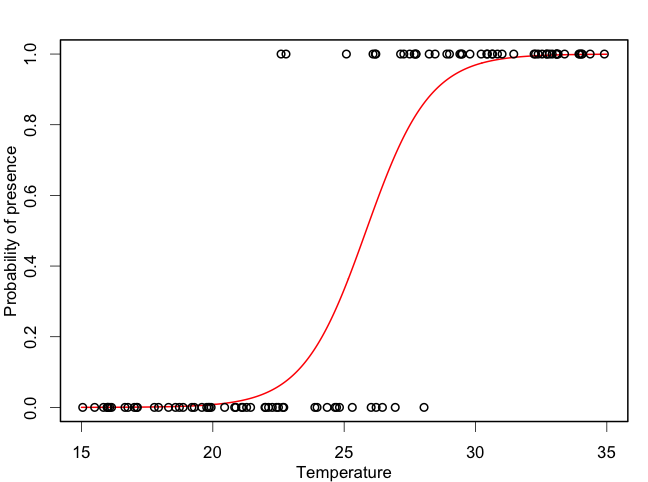
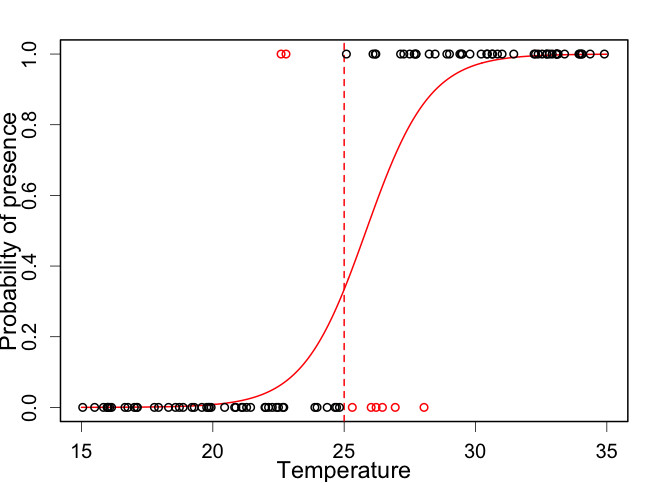
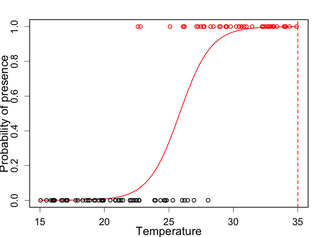
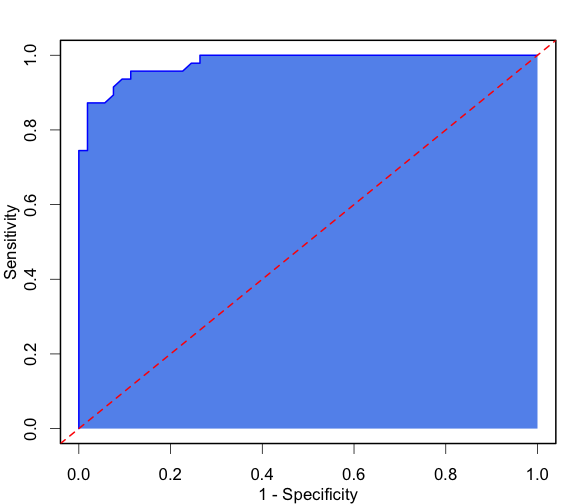
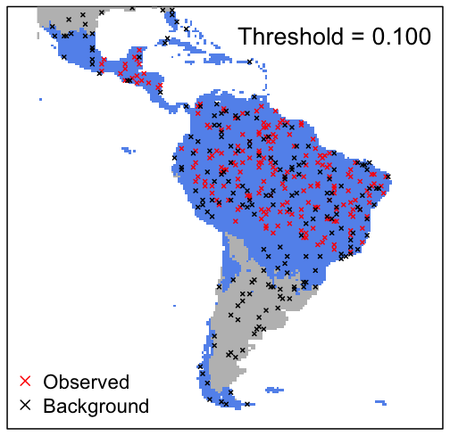

# Overview

  - The confusion matrix
  - Measures of model accuracy
  - Thresholds for continuous predictions
  - Application to Species Distribution Models

---

# MODIS land cover classification

Accuracy = 21906 / 29877 = 73.3%

---

# A simpler confusion matrix

Zoom in on just two of those categories:
 
 

Model predicts: Is this evergreen forest needleleaf or broadleaf

---

# Accuracy

Easy to calculate **accuracy**:

|            | Pred. Needle| Pred. Broad|  Sum|
|:-----------|------------:|-----------:|----:|
|Obs. Needle |         1460|          42| 1502|
|Obs. Broad  |           31|        4889| 4920|
|Sum         |         1491|        4931| 6422|

$$A = \frac{1460 + 4889}{1460 + 4889 + 42 +31} = 98.9\%$$

---

# Accuracy

But **random** models can have reasonable accuracy!

|            | Pred. Needle| Pred. Broad|  Sum|
|:-----------|------------:|-----------:|----:|
|Obs. Needle |          761|         741| 1502|
|Obs. Broad  |         2453|        2467| 4920|
|Sum         |         3214|        3208| 6422|

$$A = \frac{761 + 2467}{6422} = 50.3\%$$

---

# Accuracy

And so can stupid ones: **everything is a broadleaf**.

|            | Pred. Needle| Pred. Broad|  Sum|
|:-----------|------------:|-----------:|----:|
|Obs. Needle |            0|        1502| 1502|
|Obs. Broad  |            0|        4920| 4920|
|Sum         |            0|        6422| 6422|

$$A = \frac{0 + 4920}{6422} = 76.6\%$$

---

# Prevalence

**Prevalence** is simple the proportion of the observed positive outcomes:

$$\mbox{Prevalence} = \frac{1502 }{6422} = 0.234$$

---

# Accuracy

And **accuracy is affected by prevalence**

|            | Pred. Needle| Pred. Broad|  Sum|
|:-----------|------------:|-----------:|----:|
|Obs. Needle |            0|          35|   35|
|Obs. Broad  |            0|        6407| 6407|
|Sum         |            0|        6442| 6442|

$$A = \frac{0 + 6407}{6422} = 99.5\%$$

---

# Prediction outcomes

Giving some simple names to the four outcomes:

|            |   Pred. Needle    |    Pred. Broad    |
|:-----------|:-----------------:|:-----------------:|
|Obs. Needle | True Positive  | False Negative |
|Obs. Broad  | False Positive | True Negative  |

---

# Prediction outcomes

Other more confusing names do get used:

|            |   Pred. Needle   |   Pred. Broad    |
|:-----------|:----------------:|:----------------:|
|Obs. Needle | True Positive | Type II Error |
|Obs. Broad  | Type I Error  | True Negative |

---

# Rates of outcomes

Divide the four outcomes by the **observed** positive and negative counts to give **rates**:

|            |       Pred. Needle        |        Pred. Broad        |
|:-----------|:-------------------------:|:-------------------------:|
|Obs. Needle | True Positive Rate  | False Negative Rate |
|Obs. Broad  | False Positive Rate | True Negative Rate  |

---

# Rates of outcomes

Calculate those values:

|	| Pred. Needle	| Pred. Broad	|  Sum	|
|:-----------	| ------------:|	-----------:|	----:|
|Obs. Needle	| $$\frac{1460}{1502}=97.2\%$$	| $$\frac{42}{1502}=2.8\%$$ | 1502	|
|Obs. Broad  	| $$\frac{31}{4920}=0.6\%$$	| $$\frac{4889}{4920}=99.4\%$$	| 4920	|

---

# Sensitivity and Specificity

**Sensitivity**

  - Another name for the True Positive Rate
  - The proportion of correctly predicted positive observations

**Specificity**

  - Another name for the True Negative Rate
  - The proportion of correctly predicted negative observations

---

# Sensitivity and Specificity

|            | Pred. Needle| Pred. Broad|  Sum|
|:-----------|------------:|-----------:|----:|
|Obs. Needle |         1460|          42| 1502|
|Obs. Broad  |         2010|        2910| 4920|
|Sum         |         3470|        2952| 6422|

Outcome rates for the new model above

|            |Pred. Needle |Pred. Broad |
|:-----------|:------------|:-----------|
|Obs. Needle |97.2%        |2.8%        |
|Obs. Broad  |40.9%        |59.1%       |

---

# Cohen's kappa

Cohen's kappa ($\kappa$) is a measure of agreement that rescales accuracy ($A$) to account for chance agreement ($P_e$):

$$\kappa = \frac{A - P_e}{1- P_e}$$

It can take values from $-\infty$ to 1, where 1 is perfect prediction and anything below zero is worse than chance.

---

# Cohen's kappa

Multiply proportions of observed and predicted to get probability of each outcome

|            | Pred. Needle| Pred. Broad|  Sum|
|:-----------|------------:|-----------:|----:|
|Obs. Needle |         1460|          42| 1502|
|Obs. Broad  |           31|        4889| 4920|
|Sum         |         1491|        4931| 6422|

$$P_{YY} = \frac{1491}{6422} \times \frac{1502}{6422} = 0.054$$

---

# Cohen's kappa

|            | Pred. Needle| Pred. Broad|     p|
|:-----------|------------:|-----------:|-----:|
|Obs. Needle |        0.054|       0.180| 0.234|
|Obs. Broad  |        0.178|       0.588| 0.766|
|p           |        0.232|       0.768| 1.000|

$$
P_e = P_{YY} +  P_{NN}
\kappa = \frac{0.989 - (0.054 + 0.588)}{1- (0.054 + 0.588)} = 0.969
$$

---

# True Skill Statistic

TODO - MathJax linebreak fix?

An alternative measure is TSS:

$$
\mbox{TSS} = \mbox{Sensitivity} + \mbox{Specificity} - 1\\
\mbox{TSS} = [0, 1] + [0, 1] - 1
$$

 * TSS = 1 (perfect)
 * TSS = 0 (random)
 * TSS = -1 (always wrong)
 * Unaffected by prevalence.

<!-- Simulation of thresholding -->
  

---

# Threshold model

A model predicting the probability of success.

---

# Threshold model

|   |  0|  1|
|:--|--:|--:|
|1  |  0| 50|
|0  |  0| 50|

|     | value|
|:----|-----:|
|Sens |     1|
|Spec |     0|
|TSS  |     0|

---

# Threshold model

|   |  0|  1|
|:--|--:|--:|
|1  |  5| 45|
|0  | 19| 31|

|     | value|
|:----|-----:|
|Sens |  0.90|
|Spec |  0.38|
|TSS  |  0.28|

---

# Threshold model

|   |  0|  1|
|:--|--:|--:|
|1  | 12| 38|
|0  | 37| 13|

|     | value|
|:----|-----:|
|Sens |  0.76|
|Spec |  0.74|
|TSS  |  0.50|

---

# Threshold model

|   |  0|  1|
|:--|--:|--:|
|1  | 26| 24|
|0  | 48|  2|

|     | value|
|:----|-----:|
|Sens |  0.48|
|Spec |  0.96|
|TSS  |  0.44|

---

# Threshold model

|   |  0|  1|
|:--|--:|--:|
|1  | 50|  0|
|0  | 50|  0|

|     | value|
|:----|-----:|
|Sens |     0|
|Spec |     1|
|TSS  |     0|

---

# ROC Curve

* Receiver operating characteristic (ROC)
* A random model gives the red line

---

# Area under ROC curve (AUC)

  - AUC varies between 0 and 1.
  - AUC = 0.5 is random.
  - Overall model performance

<!-- SDM actual example  -->

---

# Species Distribution Models

Kinkajou (*Potos flavus*)

---

# Species Distribution Models

* Observed (red)
* Background (black)

---

# Species Distribution Models

	

Threshold = 0.1

|     | Present| Absent|
|:----|-------:|------:|
|Obs  |     200|      0|
|Back |     157|     43|

|     | value|
|:----|-----:|
|Sens | 0.215|
|Spec | 1.000|
|TSS  | 0.215|

---

# Species Distribution Models

Threshold = 0.4

|     | Present| Absent|
|:----|-------:|------:|
|Obs  |     184|     16|
|Back |     105|     95|

|     | value|
|:----|-----:|
|Sens | 0.475|
|Spec | 0.920|
|TSS  | 0.395|

---

# Species Distribution Models

	

Threshold = 0.55

|     | Present| Absent|
|:----|-------:|------:|
|Obs  |      78|    122|
|Back |      43|    157|

|     | value|
|:----|-----:|
|Sens | 0.785|
|Spec | 0.390|
|TSS  | 0.175|

---

# AUC for the Kinkajou

Maximum sensitivity + specificity shown in red.

---

# Species Distribution Models

	

Threshold = 0.417

|     | Present| Absent|
|:----|-------:|------:|
|Obs  |     182|     18|
|Back |      96|    104|

|     | value|
|:----|-----:|
|Sens |  0.52|
|Spec |  0.91|
|TSS  |  0.43|

---

# Threshold choices

| Method | Definition |
| --- | --- |
| Fixed value | An arbitrary fixed value (e.g. probability = 0.5) |
| Lowest predicted value | The lowest predicted value corresponding with an observed occurrence record |
| Sensitivity-specificity equality | The threshold at which sensitivity and specificity are equal |
| Sensitivity-specificity sum maximization | The sum of sensitivity and specificity is maximized |
| Maximize Kappa | The threshold at which Cohen’s Kappa statistic is maximized |
| Equal prevalence | Propn of presences relative to the number of sites is equal in prediction and calibration data  | 

---

# Fast moving field

<iframe src='https://natureconservation.pensoft.net/article/33918/' width='100%' height='500px'>

