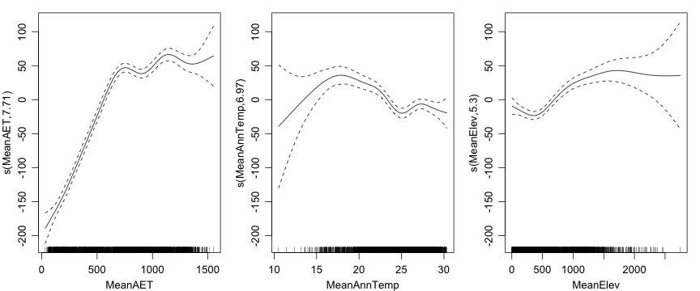
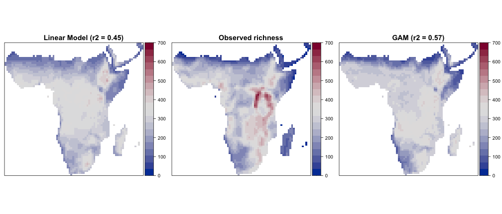
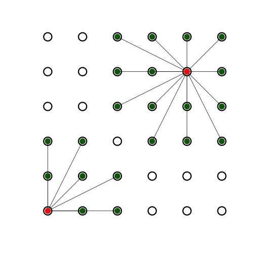
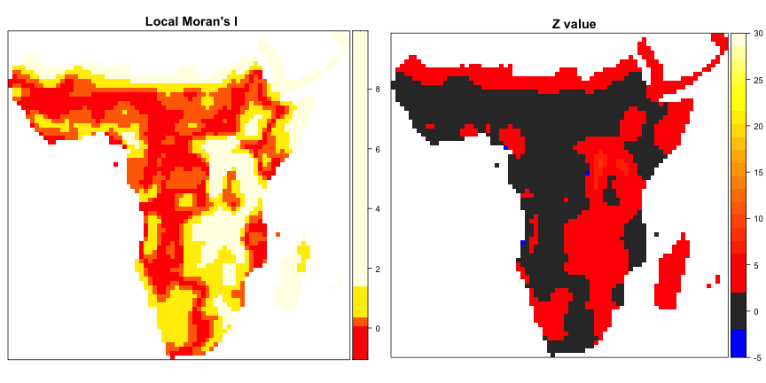
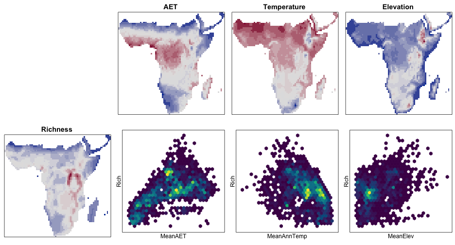
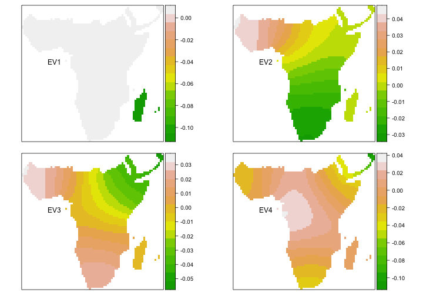

<!-- .slide: data-background-image="../shared_images/World3D_600.png"  data-background-position="right 10px bottom 20px"  data-background-size="40%" -->
# Spatial modelling

### David Orme

---

# Spatial modelling tools

* The examples presented here use R
* Another excellent program with a nice GUI interface:
    * Spatial Analysis in Macroecology
    * http://www.ecoevol.ufg.br/sam/

<!-- .element width="30%" -->

---

# Overview

* Example data: Afrotropical bird diversity
* Naive models
* Describing spatial autocorrelation
* Accounting for spatial autocorrelation

---

# Afrotropical bird species richness

Notes:
Introducing the data
Projected data - coordinates in km on Behrmann grid
100km resolution

----

# Explanatory variables

Notes:
A few simple observations:
- lots of rain and vegetation in the congo.
- pretty warm in the sahara
- the great rift is called that for a reason.

Smoothers on the data
- No way you’d want to fit this as a simple linear model

----

# A simple linear model

**Richness ~ AET + Temperature + Elevation**

|            |    Est|    SE|     t|p       |
|:-----------|------:|-----:|-----:|:-------|
|(Intercept) | 189.45| 21.33|  8.88|< 0.001 |
|MeanAET     |   0.18|  0.00| 37.34|< 0.001 |
|MeanAnnTemp |  -4.18|  0.72| -5.79|< 0.001 |
|MeanElev    |   0.08|  0.01| 13.85|< 0.001 |

----

# A simple GAM

**Richness ~ s(AET) +s( Temperature) + s(Elevation)**

----

# Model predictions

Notes:
Not great models:
 - Overpredict in Madagascar
 - GAM does better in Congo

OK - so what is the problem?

---

# Neighbourhoods

**Rooks move**

All cells within one step: 

* vertically or
* horizontally

Notes:
Neighbours on a grid
Bit different for polygons, shared edges etc. but similar concepts

----

# Neighbourhoods

**Queens move**

All cells within one step:

* vertically,
* horizontally or
* diagonally

----

# Neighbourhoods

**Distance based**

All cells within:

* 2.4 units

----

# Neighbourhoods

**_k_ nearest**

The closest _k_ cells

----

# Spatial autocorrelation

Global Moran’s I 

* I = 0.922
* p << 0.001

Global Geary’s C 

* C = 0.070
* p << 0.001

Notes:
Point close together are similar
 - how do we characterise this?
 - useful summary - global value
 - is there spatial autocorrelation - well, duh!

 Moran’s I - correlation measure (usually 0 to 1)
 Geary's C - 1 to 0

----

# Spatial autocorrelation

Global Moran’s I

* I = 0.015
* p =  0.059

Global Geary’s C 

* C = 0.984
* p =  0.059

----

# Local autocorrelation
 
Local indicators of spatial autocorrelation (LISA)
 

 
 Notes:
 Look at strength of spatial autocorrelation within neighbourhoods
 Using species richness data
 Blocks of colour show significant autocorrelation
 Not a monotonic process - will return to this later
 
---

# Effects of Spatial Autocorrelation
 
* Data points **not independent**
* Degrees of freedom reduced: 
    * **standard errors and significance testing affected**
* Not equally weighted :
    * **parameter estimation affected**

Notes:
Degrees of freedom - tends to bias towards finding significance
Parameters - can affect estimates in unpredictable ways

----

# Dealing with Spatial Autocorrelation

* Modify the degrees of freedom in significance testing
* Account for autocorrelation in models:
	* Simultaneous autoregressive models
	* Generalised least squares
	* Eigenvector filtering
	* Geographically weighted regression

----

# Degrees of freedom correction 

Notes:
Clifford test for correlation
 - use all the lags to characterise the global autocorrelation
 - work out the effective degrees of freedom
 - 2484 down to...

Other methods can correct the degrees of freedom in a simple linear model

----

# Degrees of freedom correction 

Notes:
Clifford test for correlation
 - use all the lags to characterise the global autocorrelation
 - work out the effective degrees of freedom
 - 2484 down to...

Other methods can correct the degrees of freedom in a simple linear model

----

# Spatial Autoregression

Solve for $b$:

|   |   |   |   |   |
|---|---|---|---|:---:|
| 	| 	| 	|  | $bx_1 +  \frac{1}{2}bx_2$  |
| 	| 	| 	|  | $\frac{1}{2}bx_1 +  bx_2  + \frac{1}{2}bx_3$ |
| 	| 	| 	|  | $\frac{1}{2}bx_2 +  bx_3  + \frac{1}{2}bx_4$  |
| 	| 	| 	|  | $\frac{1}{2}bx_3 +  \frac{1}{2}bx_4$  |
| $x_1$  |  $x_1$ |  $x_3$ |  $x_4$  |   |

Notes:
Simple one dimensional example
- neighbour definition and _weights_ (red=1, green=0.5)
- influence of neighbouring values
- simultaneuous equations.

----

# Spatial Autoregresssion

Notes:
Very good predictions - not even including interactions!
Autocorrelation in the residuals are very small

----

# Correlogram

Notes:
Correlograms

2484 points
	2484*2483/2 = 3083886 pairwise distances
	distance falling into 100km bands

Distance at which correlation hits the x axis
Notice negative autocorrelation at distance
Reliability of measures at distance is very poor

----

# Variogram

Notes:
Variograms
 - same idea but viewed from other end
 - if points are similar then the variance within nearby classes will be small
 - eventually get to a point where the variance is not distinguishably lower
 - about in the same place

----

# Generalised Least Squares

	

* Model correlation as a function of **distance** 
* Generate a correlation **matrix**

Notes:
Not specifically a spatial method
 - allows for all sorts of structure in the data
 - mixed effects models
 - variance structures
 - correlation structure

Wider range of variance modelling
- define a function that captures the shape of the variogram with distance
- exponential, spherical, linear
- parameters: nugget, sill, range

----

# Generalised Least Squares

	

* Different shapes:
    * Exponential
    * Spherical
    * Linear

* Parameters

----

# Generalised Least Squares

<small>

<pre>
Generalized least squares fit by REML
  Model: Rich ~ MeanAETScaled + MeanAnnTempScaled + MeanElevScaled 
  Data: figDat 
       AIC      BIC    logLik
  24676.89 24705.97 -12333.44

Correlation Structure: Gaussian spatial correlation
 Formula: ~e_centre_behr + n_centre_behr 
 Parameter estimate(s):
 range nugget 
 650.0    0.1 

Coefficients:
                      Value Std.Error   t-value p-value
(Intercept)       199.67323 16.755430 11.916927  0.0000
MeanAETScaled      17.65050  3.038337  5.809265  0.0000
MeanAnnTempScaled -27.53775  5.663121 -4.862645  0.0000
MeanElevScaled      3.59893  4.321932  0.832712  0.4051

 Correlation: 
                  (Intr) MnAETS MnAnTS
MeanAETScaled     0.048               
MeanAnnTempScaled 0.141  0.047        
MeanElevScaled    0.156  0.079  0.936 

Standardized residuals:
        Min          Q1         Med          Q3         Max 
-2.35080108  0.09376345  0.73813223  1.30659392  4.48588628 

Residual standard error: 97.85917 
Degrees of freedom: 2484 total; 2480 residual
</pre>
<!-- .element width="100%" -->

</small>

---

# Stationarity and isotropy

	
Is the same process happening in:

* different locations (stationarity)?
* different directions (isotropy)?

Is the problem in:

* the spatial structure of autocorrelation?
* differences in the actual relationship?

----

# Eigenvector filtering

* Take the **eigendecomposition** of a spatial weights model
* Use the  **eigenvectors** as variables in the model
* Use a selection process to identify and include only important eigenvectors

Notes:
* Identical process to principal component analysis
* Eigenvectors identify independent axes of variation in the model
* Separate out aspects of autocorrelation
* Tailor the autocorrelation
* Each eigenvector soaks up a residual degree of freedom

----

# Eigenvector filtering

Notes:
First four eigenvectors
 - describe independent trends in the spatial autocorrelation
 - (actually real parts of complex eigenvectors)

----

# Eigenvector filtering

	
**lm(Rich ~ MeanAET + MeanAnnTemp + MeanElev**

<small>

|            |    Est|    SE|     t|p       |
|:-----------|------:|-----:|-----:|:-------|
|(Intercept) | 189.45| 21.33|  8.88|< 0.001 |
|MeanAET     |   0.18|  0.00| 37.34|< 0.001 |
|MeanAnnTemp |  -4.18|  0.72| -5.79|< 0.001 |
|MeanElev    |   0.08|  0.01| 13.85|< 0.001 |

</small>

----

# Eigenvector filtering

**lm(Rich ~ MeanAET + MeanAnnTemp + MeanElev + Re(spEV1) + Re(spEV2) + Re(spEV3) + Re(spEV4)**

<small>

|            |      Est|     SE|      t|p       |
|:-----------|--------:|------:|------:|:-------|
|(Intercept) |    80.23|  33.00|   2.43|1.5e-02 |
|MeanAET     |     0.18|   0.01|  31.43|< 0.001 |
|MeanAnnTemp |     0.10|   1.14|   0.09|9.3e-01 |
|MeanElev    |     0.08|   0.01|  12.70|< 0.001 |
|Re(spEV1)   | -1617.63|  77.64| -20.83|< 0.001 |
|Re(spEV2)   |   963.97| 129.21|   7.46|< 0.001 |
|Re(spEV3)   |  -813.56|  95.87|  -8.49|< 0.001 |
|Re(spEV4)   |  -150.38| 100.28|  -1.50|1.3e-01 |

</small>

----

# Eigenvector filtering

**lm(Rich ~ MeanAET + MeanAnnTemp + MeanElev + Re(spEV1) + Re(spEV2) + Re(spEV3)**

<small>

|            |      Est|     SE|      t|p       |
|:-----------|--------:|------:|------:|:-------|
|(Intercept) |    58.39|  29.62|   1.97|4.9e-02 |
|MeanAET     |     0.19|   0.00|  43.68|< 0.001 |
|MeanAnnTemp |     0.75|   1.06|   0.71|4.8e-01 |
|MeanElev    |     0.08|   0.01|  13.78|< 0.001 |
|Re(spEV1)   | -1610.75|  77.53| -20.78|< 0.001 |
|Re(spEV2)   |  1031.60| 121.11|   8.52|< 0.001 |
|Re(spEV3)   |  -848.19|  93.07|  -9.11|< 0.001 |

</small>

----

# Geographically weighted regression

Fit a model for **every cell**:

* Define a local **region size** and a **weighting function**
* Fit a weighted regression for each cell using the weights
* Look at how coefficients **vary in space**
* Possibly serious statistical issues!

----

# Geographically weighted regression

Notes:
Fit a weighted regression to geographic subsets of the data.

Neighbourhood size
 - bandwidth or proportion of data
Weighting
 - weighted by normal Gaussian curve (black)
 - weighted based on squared distance

Not fitting a single regression - fitting 2484 regressions - but they are simple

----

# Geographically weighted regression
 
 

---

# Problems

* Profusion of packages: sf, sp, spdep, mgcv, ncf, gstat, nlme, spgwr
* Different data structures
* Sometimes poor documentation
* Speed of calculation (= size of dataset)
* Memory hungry
* Too many options
