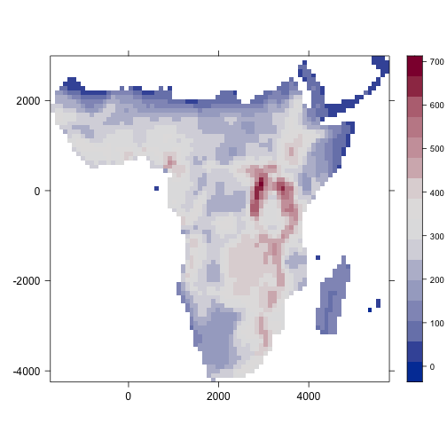
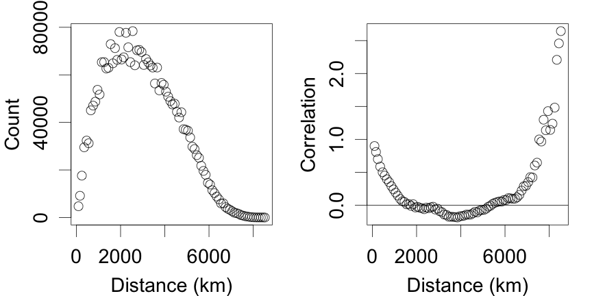
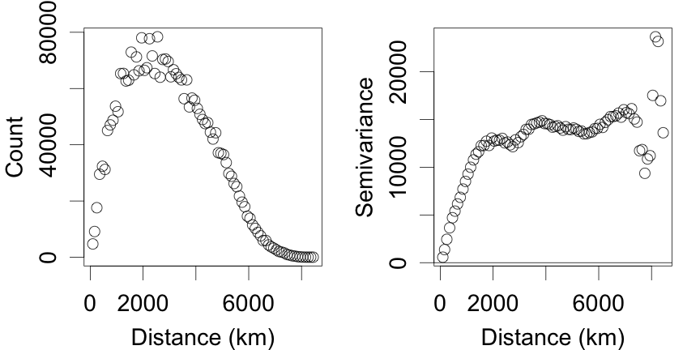
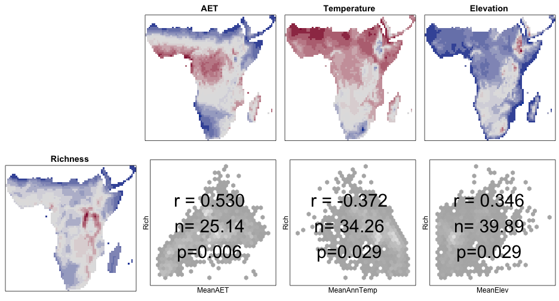
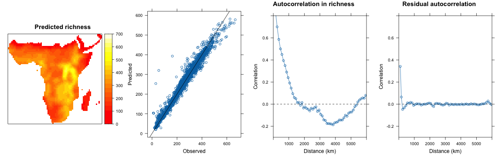
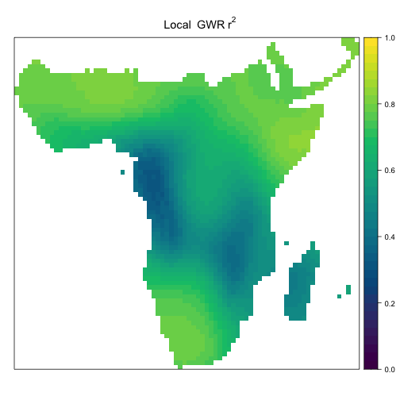

TODO: Title slide

---

# Spatial modelling tools

* The examples presented here use R
* Another excellent program with a nice GUI interface:
* Spatial Analysis in Macroecology
* http://www.ecoevol.ufg.br/sam/


---

# Overview

* Example data: Afrotropical bird diversity
* Naive models
* Describing spatial autocorrelation
* Accounting for spatial autocorrelation   (degrees of freedom correction, SAR, GLS, eigenvector filtering, GWR)


---

# Afrotropical bird species richness


Notes:
Introducing the data
Projected data - coordinates in km on Behrmann grid
100km resolution

---

# Explanatory variables


Notes:
A few simple observations:
- lots of rain and vegetation in the congo.
- pretty warm in the sahara
- the great rift is called that for a reason.

Smoothers on the data
- No way you’d want to fit this as a simple linear model

---

# A simple linear model

**Richness ~ AET + Temperature + Elevation**


|            |     Est|     SE|      t|  p|
|:-----------|-------:|------:|------:|--:|
|(Intercept) | 189.453| 21.329|  8.882|  0|
|MeanAET     |   0.176|  0.005| 37.342|  0|
|MeanAnnTemp |  -4.178|  0.722| -5.787|  0|
|MeanElev    |   0.076|  0.005| 13.849|  0|

---

# A simple GAM

**Richness ~ s(AET) +s( Temperature) + s(Elevation)**


|               |      edf|   Ref.df|          F| p-value|
|:--------------|--------:|--------:|----------:|-------:|
|s(MeanAET)     | 7.710335| 8.584611| 212.577504|       0|
|s(MeanAnnTemp) | 6.967881| 8.078738|   7.906746|       0|
|s(MeanElev)    | 5.302474| 6.489696|  12.051023|       0|

---

# Model predictions


Notes:
Not great models:
 - Overpredict in Madagascar
 - GAM does better in Congo

OK - so what is the problem?

---

# Spatial autocorrelation

<div class='container'>
<div class='col2'>



</div>
<div class='col1'>

Global Moran’s I 

* I = 0.922
* p << 0.001

</div>
</div>

Notes:
Point close together are similar
 - how do we characterise this?
 - useful summary - global value
 - is there spatial autocorrelation - well, duh!

 Moran’s I - correlation measure (usually 0 to 1)

---

# Spatial autocorrelation

<div class='container'>
<div class='col2'>


</div>
<div class='col1'>

Global Moran’s I

* I = -0.011
* p =  0.849

</div>
</div>

---

# Correlogram



Notes:
Correlograms

2484 points
	2484*2483/2 = 3083886 pairwise distances
	distance falling into 100km bands

Distance at which correlation hits the x axis
Notice negative autocorrelation at distance
Reliability of measures at distance is very poor

---

# Variogram



Notes:
Variograms
 - same idea but viewed from other end
 - if points are similar then the variance within nearby classes will be small
 - eventually get to a point where the variance is not distinguishably lower
 - about in the same place

---

# Local autocorrelation
 
Local indicators of spatial autocorrelation (LISA)
 

 
 Notes:
 Look at strength of spatial autocorrelation within neighbourhoods
 Using species richness data
 Blocks of colour show significant autocorrelation
 Not a monotonic process - will return to this later
 
---

# Effects of Spatial Autocorrelation
 
* Violates assumption of independence between data points
* Degrees of freedom not equal to number of data points: **standard errors and significance testing affected**
* Data points do not contribute equally to determining the relationship between variables: **parameter estimation affected**

Notes:
Degrees of freedom - tends to bias towards finding significance
Parameters - can affect estimates in unpredictable ways

---

# Dealing with Spatial Autocorrelation

* Modify the degrees of freedom in significance testing
* Account for autocorrelation in models:
	* Simultaneous autoregressive models
	* Generalised least squares
	* Eigenvector filtering
	* Geographically weighted regression


---

# Degrees of freedom correction 




Notes:
Clifford test for correlation
 - use all the lags to characterise the global autocorrelation
 - work out the effective degrees of freedom
 - 2484 down to...

Other methods can correct the degrees of freedom in a simple linear model

---

# Neighbourhoods


<div class='container'>
<div class='col2'>


</div>
<div class='col1'>

**Rooks move**

All cells within one step: 

* vertically or
* horizontally

</div>
</div>

Notes:
Neighbours on a grid
Bit different for polygons, shared edges etc. but similar concepts

---

# Neighbourhoods


<div class='container'>
<div class='col2'>


</div>
<div class='col1'>

**Queens move**

All cells within one step:

* vertically,
* horizontally or
* diagonally

</div>
</div>


---

# Neighbourhoods

<div class='container'>
<div class='col2'>


</div>
<div class='col1'>

**Distance based**

All cells within:

* 2.4 units

</div>
</div>


---

# Neighbourhoods


<div class='container'>
<div class='col2'>


</div>
<div class='col1'>

**_k_ nearest**

The closest _k_ cells


</div>
</div>

---

# Spatial Autoregression

Solve for $b$:


| <span class='dot'></span>  | <span class='dot'></span>  | <span class='dot'></span>  | <span class='dot'></span>  |   |
|---|---|---|---|:---:|
| <span class='dotr'></span>	| <span class='dotg'></span>	| <span class='dot'></span>	| <span class='dot'></span> | $bx_1 +  \frac{1}{2}bx_2$  |
| <span class='dotg'></span>	| <span class='dotr'></span>	| <span class='dotg'></span>	| <span class='dot'></span> | $\frac{1}{2}bx_1 +  bx_2  + \frac{1}{2}bx_3$ |
| <span class='dot'></span>	| <span class='dotg'></span>	| <span class='dotr'></span>	| <span class='dotg'></span> | $\frac{1}{2}bx_2 +  bx_3  + \frac{1}{2}bx_4$  |
| <span class='dot'></span>	| <span class='dot'></span>	| <span class='dotg'></span>	| <span class='dotr'></span> | $\frac{1}{2}bx_3 +  \frac{1}{2}bx_4$  |
| $x_1$  |  $x_1$ |  $x_3$ |  $x_4$  |   |

Notes:
Simple one dimensional example
- neighbour definition and _weights_ 
- influence of neighbouring values
- simultaneuous equations.

---

# Spatial Autoregresssion




Notes:
Very good predictions - not even including interactions!
Autocorrelation in the residuals are very small

---

# Generalised Least Squares

TODO - Slides!


Notes:
Not specifically a spatial method
 - allows for all sorts of structure in the data
 - mixed effects models
 - variance structures
 - correlation structure

Wider range of variance modelling
- define a function that captures the shape of the variogram with distance
- exponential, spherical, linear
- parameters: nugget, sill, range


--- 

# Stationarity and isotropy

Is the same process happening in:

* different locations (stationarity)?
* different directions (isotropy)?

Is the problem in:

* the spatial structure of autocorrelation?
* differences in the actual relationship?


---

# Eigenvector filtering

* Transform a spatial weights model into a series of eigenvectors
* Use eigenvectors as variables in the model
* Use a selection process to identify and include only important eigenvectors

Notes:
* Identical process to principal component analysis
* Eigenvectors identify independent axes of variation in the model
* Separate out aspects of autocorrelation
* Tailor the autocorrelation
* Each eigenvector soaks up a residual degree of freedom

---

# Eigenvector filtering


Notes:
First four eigenvectors
 - describe independent trends in the spatial autocorrelation
 - (actually real parts of complex eigenvectors)

---

# Eigenvector filtering

`lm(Rich ~ MeanAET + MeanAnnTemp + MeanElev`

<small>


|            |     Est|     SE|      t|  p|
|:-----------|-------:|------:|------:|--:|
|(Intercept) | 189.453| 21.329|  8.882|  0|
|MeanAET     |   0.176|  0.005| 37.342|  0|
|MeanAnnTemp |  -4.178|  0.722| -5.787|  0|
|MeanElev    |   0.076|  0.005| 13.849|  0|

</small>


---

# Eigenvector filtering

`lm(Rich ~ MeanAET + MeanAnnTemp + MeanElev + Re(spEV1) + Re(spEV2) + Re(spEV3) + Re(spEV4)`

<small>


|            |       Est|      SE|       t|     p|
|:-----------|---------:|-------:|-------:|-----:|
|(Intercept) |    80.231|  33.003|   2.431| 0.015|
|MeanAET     |     0.182|   0.006|  31.432| 0.000|
|MeanAnnTemp |     0.099|   1.141|   0.087| 0.931|
|MeanElev    |     0.078|   0.006|  12.703| 0.000|
|Re(spEV1)   | -1617.625|  77.641| -20.835| 0.000|
|Re(spEV2)   |   963.975| 129.208|   7.461| 0.000|
|Re(spEV3)   |  -813.557|  95.868|  -8.486| 0.000|
|Re(spEV4)   |  -150.378| 100.280|  -1.500| 0.134|

</small>

---

# Eigenvector filtering

`lm(Rich ~ MeanAET + MeanAnnTemp + MeanElev + Re(spEV1) + Re(spEV2) + Re(spEV3)`

<small>


|            |       Est|      SE|       t|     p|
|:-----------|---------:|-------:|-------:|-----:|
|(Intercept) |    58.387|  29.622|   1.971| 0.049|
|MeanAET     |     0.188|   0.004|  43.675| 0.000|
|MeanAnnTemp |     0.748|   1.056|   0.708| 0.479|
|MeanElev    |     0.080|   0.006|  13.783| 0.000|
|Re(spEV1)   | -1610.754|  77.525| -20.777| 0.000|
|Re(spEV2)   |  1031.596| 121.114|   8.518| 0.000|
|Re(spEV3)   |  -848.190|  93.068|  -9.114| 0.000|

</small>

---

# Geographically weighted regression


```
## Warning in gwr(Rich ~ MeanAET + MeanAnnTemp + MeanElev, data = figDat, adapt =
## 0.05, : standard errors set to NA, normalised RSS not available
```

```
##    user  system elapsed 
## 121.872  10.945 139.256
```


Notes:
Fit a weighted regression to geographic subsets of the data.

Neighbourhood size
 - bandwidth or proportion of data
Weighting
 - weighted by normal Gaussian curve (black)
 - weighted based on squared distance

Not fitting a single regression - fitting 2484 regressions - but they are simple

--- 

# Geographically weighted regression


---

# Geographically weighted regression
 
 
---

# Problems

* Profusion of packages: sf, sp, spdep, mgcv, ncf, gstat, nlme, spgwr
* Different data structures
* Sometimes poor documentation
* Speed of calculation (= size of dataset)
* Memory hungry
* Too many options
